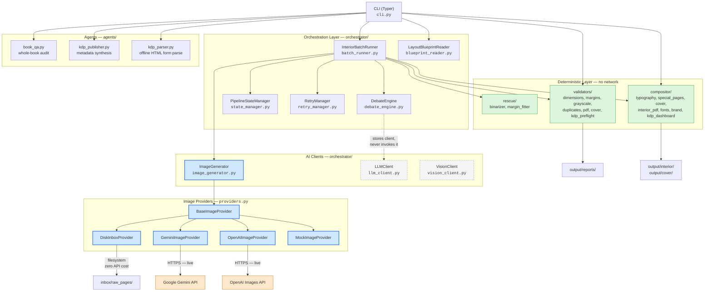
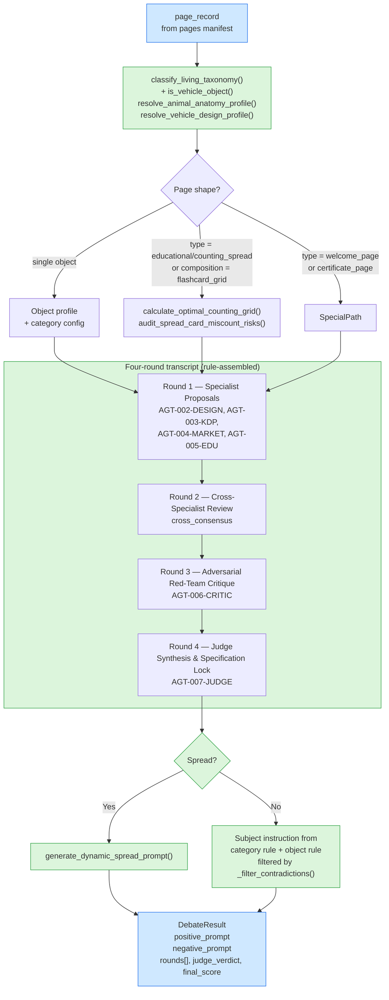
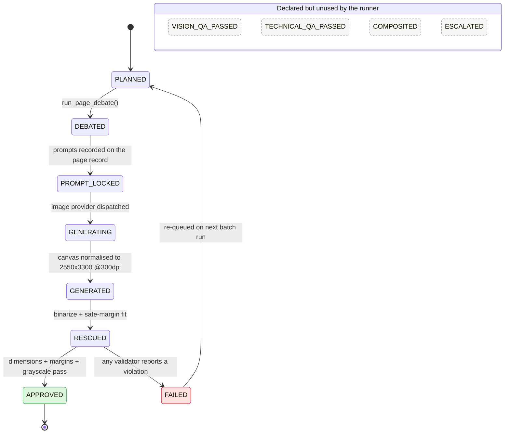

# Architecture Diagrams

Architecture diagrams for the CurioKraft Coloring Book Engine, written in Mermaid
syntax so they render inline on GitHub and stay diff-able in review.

> **Accuracy note.** These diagrams are generated from a direct read of
> `src/curiokraft_book/`. Where the implementation differs from how the project
> is described elsewhere in the docs, these diagrams document the
> implementation. See [Known Deviations from Described Design](#known-deviations-from-described-design)
> at the end of this document.

## Table of Contents
1. [High-Level Architecture](#high-level-architecture)
2. [Prompt Synthesis Flow](#prompt-synthesis-flow)
3. [Page Lifecycle State Machine](#page-lifecycle-state-machine)
4. [Class and Module Map](#class-and-module-map)
5. [Data Flow Pipeline](#data-flow-pipeline)
6. [Known Deviations from Described Design](#known-deviations-from-described-design)

---

## High-Level Architecture

**Reading the legend**

| Style | Meaning |
| --- | --- |
| Blue | On the live execution path |
| Green | Deterministic — pure Python, no network calls |
| Grey dashed | Defined in the codebase but **not reached** by the pipeline (see [Known Deviations](#known-deviations-from-described-design)) |
| Orange | External third-party service |

---

## Prompt Synthesis Flow

`DebateEngine.run_page_debate()` produces the locked positive/negative prompt for a
page. It is named a "debate" and logs a four-round transcript, but the rounds are
**deterministic rule evaluation over the taxonomy/curriculum YAML configs** — no
model call is made. Each round's `agent_outputs` is a dict assembled from
lookup profiles, not from a completion.

**Cover and mascot variants.** `run_cover_debate()` and `run_mascot_debate()` reuse the
same four-round scaffolding through `_build_cover_debate_spec()` →
`_assemble_cover_debate()` (extracted in Technical Debt Item #3). Front and back
covers keep entirely different content:

| | Front cover | Back cover |
| --- | --- | --- |
| Hero element | Character ensemble (`extract_front_cover_ensemble`) | Flashcard showcase row (`extract_cover_showcase_cards`) |
| Body content | 3D title treatment | Feature pills + parent description |
| Spine edge | LEFT edge must stay flat and borderless | RIGHT edge must stay flat and borderless |

---

## Page Lifecycle State Machine

States come from the `PageStatus` enum in `orchestrator/state_manager.py`.
Transitions shown as solid are the ones `InteriorBatchRunner.generate_single_page()`
actually performs; the grey states are declared in the enum but never set by the
current pipeline.

**Retry handling.** Page-level retries live in `RetryManager` /
`PageStateRecord.attempts` (capped at `MAX_RETRY_ATTEMPTS`), not in the state machine.
A page that exhausts its attempts stays `FAILED`; the next batch run re-processes it
from `PLANNED`.

---

## Class and Module Map

```mermaid
flowchart TD
    subgraph ProvidersBlock["Image providers — providers.py (polymorphic strategy)"]
        BaseImageProvider["BaseImageProvider<br/><i>abstract</i>"]
        GeminiImageProvider["GeminiImageProvider"]
        OpenAIImageProvider["OpenAIImageProvider"]
        DiskInboxProvider["DiskInboxProvider"]
        MockImageProvider["MockImageProvider"]

        BaseImageProvider --> GeminiImageProvider
        BaseImageProvider --> OpenAIImageProvider
        BaseImageProvider --> DiskInboxProvider
        BaseImageProvider --> MockImageProvider
    end

    subgraph ClientBlock["Clients"]
        LLMClientC["LLMClient<br/><code>llm_client.py</code>"]
        VisionClientC["VisionClient<br/><code>vision_client.py</code>"]
        ImageGeneratorC["ImageGenerator<br/><code>image_generator.py</code>"]
        ModelClientC["ModelClient<br/><i>deprecated facade</i>"]
    end

    ModelClientC -->|delegates| LLMClientC
    ModelClientC -->|delegates| VisionClientC
    ModelClientC -->|delegates| ImageGeneratorC
    ImageGeneratorC -->|selects| BaseImageProvider

    subgraph RunnerBlock["Orchestration"]
        Runner["InteriorBatchRunner"]
        Engine["DebateEngine"]
        StateM["PipelineStateManager"]
        Retry["RetryManager"]
        Limiter["RateLimiter"]
    end

    Runner --> ImageGeneratorC
    Runner --> Engine
    Runner --> StateM
    Runner --> Retry
    Runner --> DiskInboxProvider
    Runner --> Limiter
    Engine -.->|unused| LLMClientC

    subgraph ModelsBlock["Pydantic models"]
        ModelResponseM["ModelResponse"]
        DebateResultM["DebateResult"]
        DebateRoundM["DebateRound"]
        DebateProposalM["DebateProposal"]
        CoverSpecM["_CoverDebateSpec"]
        BatchReportM["BatchProductionReport"]
        PageRecordM["PageStateRecord"]
    end

    LLMClientC -->|returns| ModelResponseM
    VisionClientC -->|returns| ModelResponseM
    Engine -->|returns| DebateResultM
    DebateResultM -->|contains| DebateRoundM
    DebateRoundM -->|contains| DebateProposalM
    Engine -->|builds via| CoverSpecM
    Runner -->|returns| BatchReportM
    StateM -->|stores| PageRecordM

    subgraph ValidatorsBlock["Validators — module-level functions, not a class hierarchy"]
        VDim["validate_dimensions()"]
        VMargin["validate_margins()"]
        VBW["validate_black_and_white()"]
        VPDF["validate_interior_pdf()"]
        VCover["validate_kdp_cover()"]
        VPreflight["run_full_preflight()"]
        VRegistry["ObjectRegistryValidator<br/><i>only class here</i>"]
    end

    subgraph RescueBlock["Rescue — rescue/"]
        RBin["rescue_binarize()"]
        RFit["fit_to_safe_margins()"]
    end

    Runner --> VDim
    Runner --> VMargin
    Runner --> VBW
    Retry --> RBin
    Retry --> RFit

    classDef abstract fill:#f0e6ff,stroke:#8250df,stroke-dasharray:5 3
    classDef deprecated fill:#f5f5f5,stroke:#8b949e,stroke-dasharray:4 3
    classDef fn fill:#dcf5dc,stroke:#2ea043

    class BaseImageProvider abstract
    class ModelClientC deprecated
    class VDim,VMargin,VBW,VPDF,VCover,VPreflight,RBin,RFit fn
```

---

## Data Flow Pipeline

```mermaid
flowchart LR
    subgraph Inputs
        ManifestIn["manifest/pages_vol2.json"]
        ConfigIn["config/book_config.yaml"]
        TaxonomyIn["config/taxonomy.yaml"]
        CurriculumIn["config/curriculum.yaml"]
        InboxIn["inbox/raw_pages/"]
    end

    subgraph BatchLoop["InteriorBatchRunner — per page"]
        direction TB
        LoadRec["Load page record"] --> Synthesize["DebateEngine<br/>synthesize locked prompt"]
        Synthesize --> PickSource{"Image source"}
        PickSource -->|"force_fresh = False<br/>and file present"| CacheHit["Reuse cached raw<br/>or inbox file"]
        PickSource -->|"DiskInboxProvider hit"| InboxHit["Use user-supplied art<br/><i>zero API cost</i>"]
        PickSource -->|otherwise| APICall["ImageGenerator.generate()<br/>via Gemini / OpenAI provider"]
        CacheHit --> Normalize
        InboxHit --> Normalize
        APICall --> Normalize
        Normalize["Normalise to 2550x3300 @300dpi<br/>centred in the safe area"] --> RescueStep["RetryManager<br/>binarize + margin fit"]
        RescueStep --> TypoStep{"Spread page?"}
        TypoStep -->|Yes| SkipTypo["Skip typography overlay<br/>copy rescued file"]
        TypoStep -->|No| AddTypo["composite_typography()<br/>overlay display label"]
        SkipTypo --> Certify
        AddTypo --> Certify
        Certify["validate_dimensions()<br/>validate_margins()<br/>validate_black_and_white()"] --> StateWrite["PipelineStateManager<br/>record status + paths"]
        StateWrite --> MorePages{"More pages?"}
        MorePages -->|Yes| LoadRec
    end

    Inputs --> LoadRec
    MorePages -->|No| Assemble

    Assemble["assemble interior<br/>compile_interior_pdf()"] --> CoverBuild["cover build<br/>composite_kdp_cover()"]
    CoverBuild --> Preflight["run_full_preflight()<br/>18-point KDP diagnostic"]
    Preflight --> Outputs["output/interior/<br/>output/cover/<br/>output/reports/"]

    classDef input fill:#dcf5dc,stroke:#2ea043
    classDef process fill:#cfe8ff,stroke:#1f6feb
    classDef decision fill:#fff4cc,stroke:#bf8700
    classDef output fill:#f0e6ff,stroke:#8250df

    class ManifestIn,ConfigIn,TaxonomyIn,CurriculumIn,InboxIn input
    class LoadRec,Synthesize,CacheHit,InboxHit,APICall,Normalize,RescueStep,SkipTypo,AddTypo,Certify,StateWrite,Assemble,CoverBuild,Preflight process
    class PickSource,TypoStep,MorePages decision
    class Outputs output
```

**Parallel variant.** `run_full_book_batch_parallel(max_workers=N)` submits each page to a
`ThreadPoolExecutor` through `_generate_page_safe()`, which serialises rate-limit
tokens (`RateLimiter`, token bucket, default 60 RPM) and state writes (a `threading.Lock`)
while letting image generation and PIL work run concurrently. Pages complete in
non-deterministic order; individual page failures do not abort the batch.

---

## Known Deviations from Described Design

These were found while producing the diagrams above and are recorded here so the
documentation and the code can be reconciled deliberately.

### 1. The "multi-agent debate" makes no model calls

`DebateEngine.__init__` accepts and stores an `LLMClient` as `self.llm`, but
`self.llm` is **never referenced again** anywhere in `debate_engine.py`. All four
"rounds" are dicts built from taxonomy and curriculum lookups, and Round 4's prompt
comes from `generate_dynamic_spread_prompt()` or from category/object rule text.
Searches for `call_agent`, `self.client`, `requests.`, `httpx`, `openai` and `genai`
in that module return no call sites.

**Consequence:** the debate is a deterministic specification synthesiser. It is
reproducible and costs nothing, which is a genuine strength — but describing it as
an AI debate overstates what runs, and `curiokraft-book doctor` reporting
`Active AI Provider: GEMINI` implies text generation that does not happen.

### 2. `LLMClient` and `VisionClient` are unreachable from the pipeline

Both clients (and all their OpenAI/Anthropic/Gemini text and vision code paths) have
no production call site. The only reference anywhere is the deprecated
`ModelClient` facade in `model_client.py`, which forwards `call_agent` to
`LLMClient.call_agent` — and nothing calls the facade either.

**Consequence:** the only live AI call path in the system is **image generation**.
Technical Debt Item #6 ("split ModelClient for ISP") was completed as a structural
refactor, but the split surfaced that the text/vision halves are dead code today.

### 3. Several `PageStatus` values are never set

`GENERATING`, `VISION_QA_PASSED`, `TECHNICAL_QA_PASSED`, `COMPOSITED` and
`ESCALATED` are declared in `PageStatus` but no code path assigns them. The runner
jumps `PROMPT_LOCKED → GENERATED` and `RESCUED → APPROVED/FAILED`. The
`manifest status` command therefore cannot report those buckets as non-zero.

### 4. There is no `BaseValidator` hierarchy

The validators are module-level functions returning per-check result dataclasses
(`validate_dimensions`, `validate_margins`, `validate_black_and_white`,
`validate_interior_pdf`, `validate_kdp_cover`, `run_full_preflight`). The only
class in `validators/` is `ObjectRegistryValidator`. An earlier revision of this
document showed a `BaseValidator` → four-subclass hierarchy that does not exist.

### 5. `validate_black_and_white` runs without a preceding rescue check

The final certification step in `generate_single_page()` calls the three validators
regardless of the `rescue_ok` flag — a failed rescue is logged as a warning and the
page still proceeds to certification, where it may then pass. Worth confirming that
is intended.

---

*Last updated: 2026-09-13*
