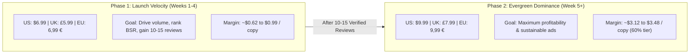

# CurioKraft Amazon KDP Global Pricing & Royalty Strategy Guide

**Publication:** *Tiny Hands Color & Learn* (and CurioKraft Series Editions)  
**Specification:** 110 Pages, Black & White Interior on White Paper, 8.5" × 11.0", Glossy Cover, No Bleed  
**Official KDP Help Policy:** [Topic G200641280 — Price Your Book](https://kdp.amazon.com/en_US/help/topic/G200641280)  
**Quick Reference Sheet:** [output/metadata/AMAZON_KDP_PRICING_AND_ROYALTIES.md](../output/metadata/AMAZON_KDP_PRICING_AND_ROYALTIES.md)

---

## 🌟 Executive Summary & Key Financial Principles

Setting book prices on Amazon KDP is not merely about currency conversion—it is governed by **royalty tier thresholds**, **local printing costs**, **Value Added Tax (VAT) laws**, and **European Fixed Price Book legislation**.

### 1. The 60% vs. 50% Royalty Rate Threshold
Amazon KDP offers two royalty tiers for standard paperbacks depending on list price:
* **Below the threshold:** Earns **50% royalty rate**.  
  `Royalty = (50% × List Price) - Printing Cost`
* **At or above the threshold:** Earns **60% royalty rate**.  
  `Royalty = (60% × List Price) - Printing Cost`

#### 💰 The "Single-Dollar Royalty Double" Effect (US Example):
* **At $8.99 (50% tier):** `(0.50 × $8.99) - $2.87` = **$1.62 profit / copy**
* **At $9.99 (60% tier):** `(0.60 × $9.99) - $2.87` = **$3.12 profit / copy**
* **Financial Impact:** A $1.00 higher price to the buyer results in **nearly double (+93%) profit** per sale!

### 2. The Danger of "Option 1" Auto-Conversion
Amazon offers two pricing modes:
* **Option 1 (Auto-Convert from Primary Marketplace):** Amazon converts $9.99 USD to foreign currencies based on floating exchange rates.
  > [!CAUTION]
  > When $9.99 USD auto-converts, it often lands around **~£7.60** in the UK and **~9,15 €** in Europe. Because £7.60 is below £7.99 and 9,15 € is below 9,99 €, **Amazon automatically demotes your royalty rate from 60% to 50%**!
* **Option 2 (Manual Entry by Marketplace — MANDATORY):** Manually type the exact list prices specified below into each regional box to permanently lock in the **60% maximum royalty tier** in every country.

---

## 🌍 Complete Global Pricing Reference Table (All 14 Marketplaces)

The following prices represent the **Evergreen Sweet Spot**: positioned below consumer psychological ceilings ($10 / £8 / 10 €), aligned with competitor standards for 110-page premium activity books, and verified against Amazon KDP minimum/maximum boundaries.

| Marketplace | Region | Minimum Required | Recommended List Price | Printing Cost | Net Royalty (Your Profit) | Royalty Tier |
| :--- | :---: | :---: | :---: | :---: | :---: | :---: |
| **Amazon.com** *(Primary)* | 🇺🇸 USA | $5.74 | **$9.99** | $2.87 | **$3.12** | **60%** ✅ |
| **Amazon.co.uk** | 🇬🇧 UK | £4.34 | **£7.99** | £2.17 | **£2.62** | **60%** ✅ |
| **Amazon.de** | 🇩🇪 Germany | 5,02 € | **9,99 €** | 2,51 € | **3,48 €** | **60%** ✅ |
| **Amazon.fr** | 🇫🇷 France | 5,02 € | **9,99 €** | 2,51 € | **3,48 €** | **60%** ✅ |
| **Amazon.es** | 🇪🇸 Spain | 5,02 € | **9,99 €** | 2,51 € | **3,48 €** | **60%** ✅ |
| **Amazon.it** | 🇮🇹 Italy | 5,02 € | **9,99 €** | 2,51 € | **3,48 €** | **60%** ✅ |
| **Amazon.nl** | 🇳🇱 Netherlands | 5,02 € | **9,99 €** | 2,51 € | **3,48 €** | **60%** ✅ |
| **Amazon.be** | 🇧🇪 Belgium | 5,02 € | **9,99 €** | 2,51 € | **3,48 €** | **60%** ✅ |
| **Amazon.ie** | 🇮🇪 Ireland | 5,02 € | **9,99 €** | 2,51 € | **3,48 €** | **60%** ✅ |
| **Amazon.ca** | 🇨🇦 Canada | $7.14 CAD | **$13.99** | $3.57 CAD | **$4.82 CAD** | **60%** ✅ |
| **Amazon.com.au** | 🇦🇺 Australia | $10.78 AUD | **$14.99** | $5.39 AUD | **$3.60 AUD** | **60%** ✅ |
| **Amazon.co.jp** | 🇯🇵 Japan | ¥ 1,000 | **¥ 1,100** | ¥ 536 | **¥ 124 JPY** | **60%** ✅ |
| **Amazon.pl** | 🇵🇱 Poland | 23,52 zł | **42,99 zł** | 11,76 zł | **14,03 zł** | **60%** ✅ |
| **Amazon.se** | 🇸🇪 Sweden | 56,12 kr | **119,00 kr** | 28,06 kr | **43,34 kr** | **60%** ✅ |

---

## ⚖️ Legal & Tax Compliance

### 1. European "Fixed Price Law" Compliance
Several European nations enforce statutory book fixed-price legislation (*Loi Lang* in France, *Buchpreisbindungsgesetz* in Germany, and equivalent laws in Austria, Belgium, Italy, Netherlands, and Spain) prohibiting price discrepancies across commercial distribution channels.
* **CurioKraft Implementation:** Setting an identical list price of **9,99 €** across all Eurozone marketplaces (`.de`, `.fr`, `.es`, `.it`, `.nl`, `.be`, `.ie`) guarantees total compliance with statutory European pricing laws.

### 2. Value Added Tax (VAT) Treatment
* Unlike US sales tax which is calculated at checkout, Amazon list prices in the UK and European Union **include local VAT**.
* Because children's educational and coloring paperbacks benefit from zero-rating or reduced VAT rates across most European jurisdictions (e.g. 0% in the UK, reduced rates in the EU), net publisher royalties remain robust at ~**3,48 € / copy**.

---

## 📦 Expanded Distribution Analysis

On `Amazon.com` and `Amazon.co.uk`, Amazon provides an **Expanded Distribution** checkbox.

* **Expanded Distribution Royalty Rate:** **40%**
* **Royalty Calculation:** `(40% × List Price) - Printing Cost`
  * At $9.99: `(0.40 × $9.99) - $2.87` = **$1.13 net royalty per copy**
* **Distribution Channels:** Ingestion into the Ingram Book Network, Baker & Taylor, Barnes & Noble, and international public/school libraries.
* **Strategic Recommendation:** **Enable (Check Box = YES)**. There is zero marginal cost or risk; it opens institutional sales channels outside Amazon's consumer marketplace.

---

## 📈 Strategic Pricing Life-Cycle (Launch vs. Evergreen)

Authors can execute either an immediate Evergreen strategy or a 2-Phase Launch Ramp:

* **Option A — Immediate Evergreen ($9.99 / £7.99 / 9,99 €) — [Recommended]:** If launching with paid Amazon Ads, immediate organic social promotion, or gifts, $9.99 is the trusted standard for 110-page toddler books.
* **Option B — Launch Ramp ($6.99 / £5.99 / 6,99 €):** Sacrifices short-term margin for algorithmic sales velocity during the initial 30 days.

---

*CurioKraft Publications — Engineering Publishing-House Quality Through AI Precision & Deterministic Code.*
