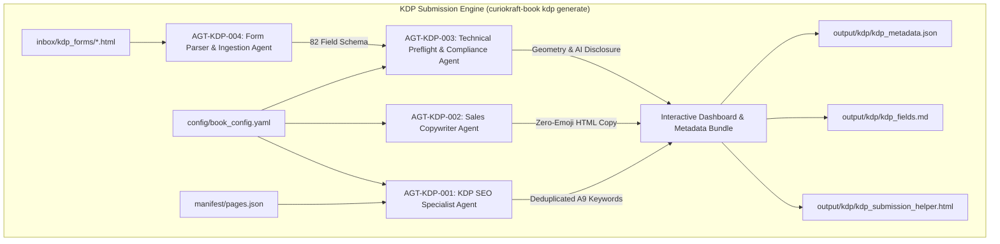

# Amazon KDP Publishing & Metadata Automation Guide

**Version:** 2.0 (Multi-Agent KDP Submission Engine with 4 Specialist Agents)  
**CLI Command:** `curiokraft-book kdp generate`  
**Interactive Dashboard:** `output/kdp/kdp_submission_helper.html`  
**Schema Definition:** `src/curiokraft_book/agents/kdp_publisher.py`  
**HTML Ingestion Parser:** `src/curiokraft_book/agents/kdp_parser.py`

---

## 🎯 Overview

Publishing an interior coloring book to Amazon Kindle Direct Publishing (KDP) requires navigating 3 multi-field web screens:
1. **Tab 1: Paperback Details** (Title, Subtitle, Author, Description, 7 Backend Keywords, Categories, Classification Checkboxes)
2. **Tab 2: Paperback Content** (ISBN, Print Geometry, Interior & Cover Uploads, Barcode Box, Mandatory AI Content Disclosure)
3. **Tab 3: Paperback Rights & Pricing** (Territories, Primary Marketplace, List Price, Global Royalties, Expanded Distribution)

The CurioKraft KDP Publishing Engine eliminates manual data entry errors, maximizes Amazon A9 search visibility, enforces Amazon's strict text validation rules, and produces a **1-Click Copy-to-Clipboard local dashboard** with full multi-agent audit transparency.

---

## ⚠️ Inviolable Amazon KDP Publishing Rules

### 1. Zero Emojis & Standard Characters Only
> [!CAUTION]
> **Amazon Text Validation Rejection:**  
> Amazon rejects any description or metadata containing emojis or decorative symbols with the error:  
> `Emoji characters are not supported. Please use standard characters only.`  
> 
> * **Prohibited:** Emojis (✨, 🖍️, 🐼, 📋, ✓), star symbols (★, ☆), decorative arrows (➔, ►), or non-ASCII glyphs.
> * **Required:** Standard ASCII alphanumeric characters, standard punctuation, and Amazon-approved HTML tags (`<h2>`, `<h3>`, `<p>`, `<b>`, `<i>`, `<ul>`, `<li>`, `<br>`).
> * Our publishing engine strictly strips non-standard symbols and asserts zero-emoji compliance in automated unit tests (`tests/test_kdp_publisher.py`).

### 2. Title & Subtitle Exact Match + 200-Character Limit
* **1:1 Cover Match:** Amazon requires the Title (`TINY HANDS COLOR & LEARN`) and Subtitle (`FUN & EASY FIRST WORDS - Vol 2`) entered in KDP to match the physical printed front cover **word-for-word**. Any discrepancy leads to pre-publication rejection by Amazon human review.
* **Combined Length Limit:** KDP strictly enforces that **Title + Subtitle combined length must be $\le 200$ characters** (including spaces). Our engine validates this limit on every run (e.g., 54 / 200 characters for Vol 2).

### 3. Classification Checkboxes: Low-Content vs. Large-Print
* **Low-Content Book Checkbox:** **Unchecked / No**
  * *Why:* KDP defines "low-content books" as notebooks, planners, or blank journals. A structured children's coloring book with bespoke illustrations, structured curriculum spreads, and guided vocabulary is legally classified as a standard book. Checking this box forfeits your free KDP ISBN, automated barcode assignment, and Expanded Distribution.
* **Large-Print Book Checkbox:** **Checked / Yes**
  * *Why:* Our toddler vocabulary headers use 200pt+ hollow bubble lettering and large readable text exceeding 16pt font size. This qualifies the book for Amazon's Large Print badge and specialized search filters.

---

## 🚀 Quick Start: 1 Command to Publish

To generate the complete metadata package for your active book:
```powershell
cd coloring-book
curiokraft-book kdp generate
```

This single command:
1. Detects your active volume configuration (`config/book_config.yaml`).
2. Optionally parses live form elements dropped in `inbox/kdp_forms/`.
3. Convenes the **4 Specialist Publishing Agents** to synthesize copy, keywords, categories, and technical specs.
4. Generates:
   * **`output/kdp/kdp_submission_helper.html`** (Interactive browser dashboard with 1-click copy buttons).
   * **`output/kdp/kdp_fields.md`** (Quick terminal-friendly markdown cheat sheet).
   * **`output/kdp/kdp_metadata.json`** (Machine-readable metadata bundle).
5. Automatically launches the dashboard in your default browser.

---

## 📂 Optional: Dropping KDP HTML Forms (`inbox/kdp_forms/`)

You can have the engine inspect live form changes directly from Amazon KDP:
1. When on any of the 3 KDP paperback tabs, press `Ctrl + S` in your browser.
2. Save as **"Webpage, HTML Only"** or **"Webpage, Complete"** into:
   ```text
   coloring-book/inbox/kdp_forms/
   ```
   *(Examples: `tab1_details.html`, `tab2_content.html`, `tab3_pricing.html`)*
3. Run `curiokraft-book kdp generate` (or `curiokraft-book kdp parse` to inspect fields).
4. The built-in HTML parser (`kdp_parser.py`) extracts inputs, textareas, selects, maxlengths, labels, and checkboxes (mapping all 82 fields across the 3 tabs) to automatically align generated outputs.

> [!NOTE]
> Dropping an HTML file is **completely optional**. If `inbox/kdp_forms/` is empty, the engine uses its built-in full KDP schema to generate 100% of all required fields.

---

## 🧠 The 4 Specialist Publishing Agents



### 1. KDP SEO & Keyword Specialist Agent (`AGT-KDP-001`)
* **The Amazon A9 Inviolable Rule (Negative Deduplication):**
  Amazon automatically indexes all words in your **Book Title** (`TINY HANDS COLOR & LEARN`), **Subtitle** (`FUN & EASY FIRST WORDS - Vol 2`), and **Author Name** (`CurioKraft Kids`). Repeating these words in the 7 backend keyword boxes is a critical mistake that wastes valuable search surface.
* **Our Deduplicated Strategy:**
  The SEO Agent removes all title/subtitle words and generates 7 distinct, high-intent parent/teacher search phrases ($\le 50$ characters each):
  1. `toddler activity book ages 1-3` (30 chars)
  2. `chunky bold outlines simple drawings` (36 chars)
  3. `preschool speech development activity gift` (42 chars)
  4. `screen free travel road trip activities` (39 chars)
  5. `kindergarten fine motor skills practice` (39 chars)
  6. `big simple animal pictures boys girls` (37 chars)
  7. `single sided bleed guard thick lines` (36 chars)
* **Categories:** Synthesizes structured Category Modal navigation trees matching Amazon's updated category selection interface.

---

### 2. Amazon Sales Copywriter Agent (`AGT-KDP-002`)
* **Strict KDP HTML Compliance:** Amazon only allows a specific subset of HTML tags (`<h2>`, `<h3>`, `<p>`, `<b>`, `<i>`, `<ul>`, `<li>`, `<br>`). Using forbidden tags (`<style>`, `<script>`, `<div>`) causes form submission failures.
* **Zero Emojis & Standard Typography:** Replaces decorative stars and emojis with bold headers and standard bullet lists.
* **Conversion Architecture:**
  * **Headline:** Catchy uppercase hook celebrating Volume 2 and joyful learning.
  * **Parent Story Hook:** Highlighting fine motor skills, speech development, and toddler confidence.
  * **Bullet Points:** Explaining chunky bold outlines, 110 double-sided pages, single-sided recto layout with bleed guards, and the baby panda mascot companion.
  * **Technical Specs:** Clarifying 8.5 x 11 inch format and wipe-clean glossy cover.

---

### 3. KDP Compliance & Technical Preflight Agent (`AGT-KDP-003`)
* **Exact Print Geometry:** Pulls verified values matching the book's physical build:
  * Trim: `8.5 x 11 in (21.59 x 27.94 cm)`
  * Interior Paper: `Black & white interior with white paper`
  * Bleed: `No Bleed`
  * Page Count: `110 pages`
  * Cover Finish: `Glossy`
  * Page Direction: `Left to right`
* **Amazon 2024/2026 Mandatory AI Content Disclosure:**
  * *AI in Text?* `No` (Curriculum and words are 100% human-designed).
  * *AI in Images?* `Yes` -> `Some sections with minimal or no edits` -> `Google Gemini 2.5 Flash / Imagen 3 used for initial line art drafts with publisher prompt engineering; post-processed with Otsu thresholding and safe vector margins.`
  * *AI in Translations?* `No`.
* **Pricing & Royalties:**
  * List Price: `$6.99 USD` (60% royalty tier yielding ~$2.15 profit per copy).
  * Expanded Distribution: `Enabled`.

---

### 4. Amazon Form Ingestion & Reverse Engineering Agent (`AGT-KDP-004`)
* **Live DOM Introspection:** Scans dropped HTML files in `inbox/kdp_forms/`.
* **Field Alignment:** Detects 82 distinct inputs across all 3 publishing tabs, mapping exact form IDs, names, character limits, select options, and checkboxes.
* **Audit Trail:** Feeds live form constraints back to AGT-KDP-001 through AGT-KDP-003, ensuring 100% field parity.

---

## 🗂️ Step-by-Step Category Modal Navigation Trees

Amazon KDP's category selection uses an interactive modal dialog with hierarchical dropdowns and placement checkboxes (`[X] Nonfiction` / `[X] Fiction`). Navigate to and tick the following 3 categories:

### Category 1: Coloring Books
```text
Root Dropdown:       Children's Books
 └── Category:       Activities, Crafts & Games
      └── Subcategory: Activity Books
           └── Leaf:  Coloring Books
Placement Checkbox:  [X] Nonfiction
```

### Category 2: Early Learning Words (Recommended & Verified in UI)
```text
Root Dropdown:       Children's Books
 └── Category:       Early Learning
      └── Subcategory: Basic Concepts
           └── Leaf:  Words
Placement Checkboxes: [X] Nonfiction
                      [X] Fiction
```

### Category 3: Animal Recognition
```text
Root Dropdown:       Children's Books
 └── Category:       Animals
      └── Leaf:      Mammals
Placement Checkbox:  [X] Nonfiction
```

---

## 🖥️ The Interactive 1-Click Copy Dashboard

When you run `curiokraft-book kdp generate`, it creates `output/kdp/kdp_submission_helper.html` organized into **4 interactive tabs**:

| Tab | Title | Contents & Key Features |
| :---: | :--- | :--- |
| **Tab 1** | Paperback Details | Title, Subtitle, Title+Subtitle character check (54/200), Edition, Author parts, Description with live store preview, 7 deduplicated A9 keywords, and Category trees. |
| **Tab 2** | Paperback Content | Free KDP ISBN reminder, Print Geometry radio buttons, interior/cover file picker paths with 1-click copy, Barcode checkbox guidance, and full AI disclosure answers. |
| **Tab 3** | Rights & Pricing | Worldwide territories, Primary marketplace (`amazon.com`), List price ($6.99 USD), estimated royalty breakdown, and international price references. |
| **Tab 4** | Agent Deliberations & Audit | Full transparent audit trail displaying the reasoning, search algorithms, and compliance rationale of all 4 agents (AGT-KDP-001 through AGT-KDP-004). |

### Key Dashboard Features:
* **1-Click Copy:** Every field has a standard `[Copy]` button that copies clean text to clipboard and flashes a green `Copied!` indicator (strictly zero emojis).
* **Live Character Counters:** Shows actual length vs. Amazon's strict limits (e.g. Subtitle: 29 / 200, Keywords: $\le 50$ chars).
* **Live HTML Preview:** Renders your HTML description exactly as Amazon customers will see it on the live product page.
* **100% Offline:** Self-contained CSS and JavaScript with zero external CDN dependencies.

---

## 📋 CLI Commands Reference

| Command | Description |
| :--- | :--- |
| `curiokraft-book kdp generate` | Synthesize metadata, build bundle, and launch interactive browser dashboard |
| `curiokraft-book kdp generate --no-open` | Build bundle without launching browser automatically |
| `curiokraft-book kdp show` | Display formatted summary table in your terminal |
| `curiokraft-book kdp parse` | Inspect and parse HTML forms dropped in `inbox/kdp_forms/` |
