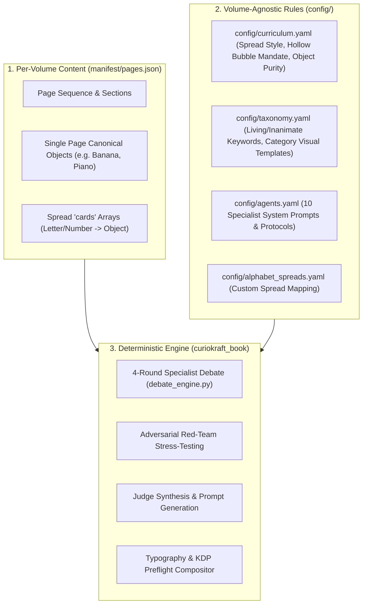

# CurioKraft Multi-Volume Architecture & Scaling Guide (Vol 1, Vol 2, Vol 3+)

This guide explains how the CurioKraft Coloring Book Production System is engineered with **zero hardcoded state in application code**, allowing you to create completely new volumes (Vol 2, Vol 3), themed editions (Animals, Vehicles, Foods), or custom curriculum spreads effortlessly.

---

## 🏛️ The 3-Tier Decoupled Architecture



---

## 📁 Configuration vs. Manifest Responsibilities

| File | Scope | Responsibilities | Volume 2 / Volume 3 Impact |
| :--- | :--- | :--- | :--- |
| `manifest/pages.json` | **Volume-Specific** | Master 110-page sequence. Contains `page_id`, `display_label`, `canonical_object`, `section`, and spread `cards` array (e.g. A=Apple, 8=Plain Wooden Cubes). | **Modify Here:** Provide new words, objects, and card lists. |
| `config/curriculum.yaml` | **Volume-Agnostic** | Spread layout templates (`alphabet_a_m`, `numbers_0_5`), hollow bubble numeral fill mandate, container uniformity rules, and object purity rejections (e.g. rejecting alphabet blocks). | **No change needed** across volumes. |
| `config/taxonomy.yaml` | **Volume-Agnostic** | Living creature keywords, inanimate exceptions (`rocking_horse`, `toy_robot`), and category-specific visual prompt templates (`vehicles`, `food`, `toys`, `nature`). | **No change needed** unless introducing novel categories. |
| `config/agents.yaml` | **System-Level** | System prompts, temperatures, and deliberation protocols for all 10 specialist agents. | **No change needed**. |
| `curiokraft_book/` | **Code Logic** | Pure logic: reads manifest and configs dynamically. Contains **zero hardcoded keyword sets or card object lists**. | **Zero code changes required**. |

---

## 🚀 How to Produce Volume 2 (Step-by-Step)

### Step 1: Create the Volume 2 Manifest
Define your new vocabulary in `manifest/pages_vol2.json` (or replace `manifest/pages.json`). 

Example of custom educational spreads and new vocabulary words for Volume 2:
```json
{
  "manifest_version": "2.0",
  "book_title": "TINY HANDS COLOR & LEARN — VOLUME 2",
  "subtitle": "ANIMALS, VEHICLES & FIRST ADVENTURES",
  "publisher_brand": "CURIOKRAFT-KIDS",
  "total_pages": 110,
  "pages": [
    {
      "page_id": "P001",
      "page_number": 1,
      "section": "Front Matter",
      "canonical_object": "welcome_belongs_to",
      "display_label": "THIS BOOK BELONGS TO",
      "type": "welcome_page"
    },
    {
      "page_id": "P002",
      "page_number": 2,
      "section": "A-Z Alphabet",
      "canonical_object": "alphabet_a_to_m",
      "display_label": "A - M FIRST WORDS",
      "type": "educational_spread",
      "cards": [
        {
          "letter": "A",
          "object": "astronaut",
          "is_living": true,
          "description": "cute friendly Astronaut in space suit",
          "negative_tokens": []
        },
        {
          "letter": "B",
          "object": "butterfly",
          "is_living": true,
          "description": "cute friendly Butterfly with open wings",
          "negative_tokens": []
        }
      ]
    },
    {
      "page_id": "P006",
      "page_number": 6,
      "section": "Safari Animals",
      "canonical_object": "lion",
      "display_label": "LION"
    }
  ]
}
```

---

### Step 2: Export Prompts for Volume 2
Export the synthesized prompts for the new volume:
```powershell
curiokraft-book prompt export --out generated/prompts_vol2.md
```

---

### Step 3: Produce Volume 2 (Choose Free Web UI or Automated API)

#### Option A: Using the Free Web UI Workflow
1. Generate in Google AI Studio using prompts from `generated/prompts_vol2.md`.
2. Save downloaded images as `inbox/raw_pages/raw_p002_alphabet_a_to_m.png`, `inbox/raw_pages/raw_p006.png` (or `raw_p006_lion.png`).
   *(Note: You can use page numbers like `raw_p006.png` without needing the object name!)*
3. Run the ingest command:
   ```powershell
   curiokraft-book ingest
   ```

#### Option B: Using Automated API Batch
```powershell
curiokraft-book generate book --source openai
```

---

### Step 4: Build Cover & Assemble Interior
```powershell
# 1. Composite KDP full-wrap cover
curiokraft-book cover build

# 2. Compile interior PDF
curiokraft-book assemble interior

# 3. Verify KDP preflight
curiokraft-book preflight run
```

**Result:** A brand new 110-page Volume 2 print-ready book is built with 100% compliant KDP geometry, dynamic typography, and zero application code changes!
