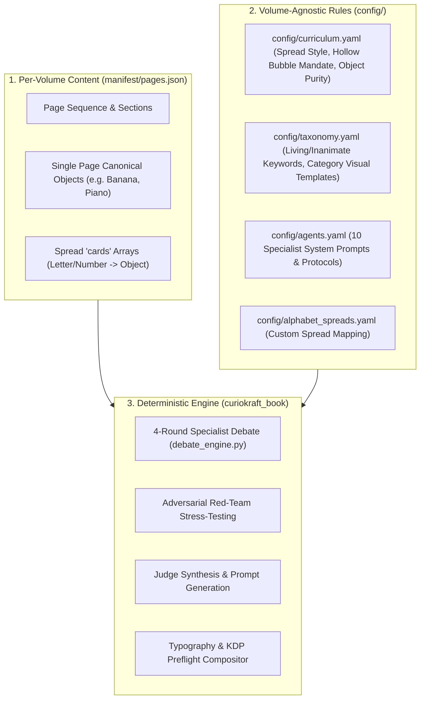

# CurioKraft Multi-Volume Architecture & Scaling Guide (Vol 1, Vol 2, Vol 3+)

This guide explains how the CurioKraft Coloring Book Production System is engineered with **zero hardcoded state in application code**, allowing you to create completely new volumes (Vol 2, Vol 3), themed editions (Animals, Vehicles, Foods), or custom curriculum spreads effortlessly.

---

## 🏛️ The 3-Tier Decoupled Architecture



---

## 📁 Configuration vs. Manifest Responsibilities

| File | Scope | Responsibilities | Volume 2 / Volume 3 Impact |
| :--- | :--- | :--- | :--- |
| `config/book_config.yaml` | **Single Source of Truth** | Master publishing metadata: Title, subtitle, author/imprint, target page count (110, 80, etc.), trim size, spine formula, safe margins, sections outline, and barcode placement. | **Modify Here:** The sole authority for book title, subtitle, target age range, page count, and print geometry. |
| `manifest/pages.json` | **Pure Content Manifest** | Master page sequence. Contains strictly `manifest_version` and `pages` array (`page_id`, `display_label`, `canonical_object`, `section`, `cards`). Contains zero duplicate book metadata or global rules. | **Modify Here:** Provide new words, objects, and card lists. |
| `manifest/objects.json` | **Volume-Specific Registry** | Object vocabulary dictionary with singular/plural constraints, category mappings, and anti-duplication rules. | **Modify Here:** Add new objects for the volume. |
| `config/curriculum.yaml` | **Volume-Agnostic** | Spread layout templates (`alphabet_a_m`, `numbers_0_5`), hollow bubble numeral fill mandate, container uniformity rules, and object purity rejections. | **No change needed** across volumes. |
| `config/taxonomy.yaml` | **Volume-Agnostic** | Living creature keywords, locomotion matrix (`quadrupeds`, `bipeds`, etc.), vehicle domain matrix, inanimate exceptions, and visual prompt templates. | **No change needed** unless introducing novel categories (e.g. Dinosaurs, Space). |
| `config/agents.yaml` | **System-Level** | System prompts, temperatures, and deliberation protocols for all 10 specialist agents. | **No change needed**. |
| `src/curiokraft_book/constants.py` | **Central Engine Standard** | Single source of truth for KDP publishing dimensions, paper thickness multipliers, default paths, and quality thresholds; loads and binds to `book_config.yaml`. | **Zero code changes required**. |
| `curiokraft_book/` | **Code Logic** | Pure logic: reads manifest, constants, and configs dynamically. Contains **zero hardcoded keyword sets or card object lists**. | **Zero code changes required**. |

---

## 🚀 How to Produce Volume 2 (Step-by-Step)

### Step 0: Configure Book Metadata (`config/book_config.yaml`)
Before generating pages or manifests, set your book metadata in `config/book_config.yaml`:
```yaml
book:
  title: "TINY HANDS COLOR & LEARN — VOLUME 2"
  subtitle: "ANIMALS, VEHICLES & FIRST ADVENTURES"
  brand: "CURIOKRAFT-KIDS"
  manifest: "manifest/pages_vol2.json" # <--- Active manifest pointer for Volume 2
  target_audience:
    age_min: 1
    age_max: 4
    description: "Toddler & preschool coloring book"
  
  interior:
    page_count: 110            # Or customize (e.g. 80, 100, 120)
    color_mode: "black_and_white"
    paper_type: "white"        # white | cream | color
    trim_size:
      width_in: 8.5
      height_in: 11.0
  
  cover:
    type: "paperback"
    overall_dimensions_in:
      width: 17.498            # (2 * 0.125) + (2 * 8.5) + spine_width_in
      height: 11.250           # (2 * 0.125) + 11.0
    spine_width_in: 0.248      # 110 pages * 0.002252 in/page
    spine:
      mode: "clean_background" # Seamless wraparound background art
```
> [!TIP]
> **Zero Code Edits:** All publishing dimensions, page budgets, title labels, and the active manifest path are loaded dynamically into the pipeline via `curiokraft_book.constants.load_book_config()`.

---

### Step 1: Create the Volume 2 Manifest
Define your new vocabulary in `manifest/pages_vol2.json`.

> [!NOTE]
> **How the Code Automatically Picks Volume 2:**
> Setting `manifest: "manifest/pages_vol2.json"` in `config/book_config.yaml` immediately routes all engines, prompt exporters, and compositors to Volume 2 with zero file renaming!
> You can also override the manifest dynamically on any CLI command using `--manifest manifest/pages_vol2.json` (or `-m`). 

Example of custom educational spreads and new vocabulary words for Volume 2:
```json
{
  "manifest_version": "1.0",
  "pages": [
    {
      "page_id": "P001",
      "page_number": 1,
      "section": "Front Matter",
      "canonical_object": "welcome_belongs_to",
      "display_label": "THIS BOOK BELONGS TO",
      "type": "welcome_page"
    },
    {
      "page_id": "P002",
      "page_number": 2,
      "section": "A-Z Alphabet",
      "canonical_object": "alphabet_a_to_m",
      "display_label": "A - M FIRST WORDS",
      "type": "educational_spread",
      "cards": [
        {
          "letter": "A",
          "object": "astronaut",
          "is_living": true,
          "description": "cute friendly Astronaut in space suit",
          "negative_tokens": []
        },
        {
          "letter": "B",
          "object": "butterfly",
          "is_living": true,
          "description": "cute friendly Butterfly with open wings",
          "negative_tokens": []
        }
      ]
    },
    {
      "page_id": "P006",
      "page_number": 6,
      "section": "Safari Animals",
      "canonical_object": "lion",
      "display_label": "LION"
    }
  ]
}
```

> [!TIP]
> **Zero Duplicate Config Files (Alphabet Spreads Unified):**
> You do **NOT** need to edit or duplicate `config/alphabet_spreads.yaml`!
> - **Option 1 (Custom Cards in Manifest):** Define `"cards"` directly inside P002 / P003 in your volume manifest (e.g. `A` for Astronaut, `B` for Butterfly). The prompt exporter directly uses these cards as the single source of truth.
> - **Option 2 (Automatic A–Z Page Matcher):** If you omit the `"cards"` array on P002 / P003, the pipeline automatically scans your volume's interior pages (Pages 5–110) to find matching words for letters A through Z. Any missing letter is automatically filled with a preschool-safe fallback dictionary.

---

### Step 2: Export Prompts for Volume 2
Export the synthesized prompts for the new volume:
```powershell
curiokraft-book prompt export --out generated/prompts_vol2.md
```

---

### Step 3: Produce Volume 2 (Choose Free Web UI or Automated API)

#### Option A: Using the Free Web UI Workflow
1. Generate in Google AI Studio using prompts from `generated/prompts_vol2.md`.
2. Save downloaded images as `inbox/raw_pages/raw_p002_alphabet_a_to_m.png`, `inbox/raw_pages/raw_p006.png` (or `raw_p006_lion.png`).
   *(Note: You can use page numbers like `raw_p006.png` without needing the object name!)*
3. Run the ingest command:
   ```powershell
   curiokraft-book ingest
   ```

#### Option B: Using Automated API Batch
```powershell
curiokraft-book generate book --source openai
```

---

### Step 4: Build Cover & Assemble Interior
```powershell
# 1. Composite KDP full-wrap cover
curiokraft-book cover build

# 2. Compile interior PDF
curiokraft-book assemble interior

# 3. Verify KDP preflight
curiokraft-book preflight run
```

**Result:** A brand new 110-page Volume 2 print-ready book is built with 100% compliant KDP geometry, dynamic typography, and zero application code changes!

---

## 🔄 Handling Volume 2 with Different Objects for the SAME Category

### Question:
*Does the Master Prompt Architecture support Volume 2 if it features a different set of objects within the same existing categories (e.g. Fruits & Vegetables, Vehicles, Animals)?*

### Answer:
**YES — 100% automatically with ZERO application code changes and ZERO prompt template rewrites.**

Because the **Category Rules** are *behavioral and visual* rather than item-specific:
- **Category Rule for `Fruits & Vegetables`:**  
  *"Preserve the natural recognizable physical shape, structure, and essential characteristics of the fruit or vegetable. Keep surface details minimal; large open coloring zones."*

#### Volume 1 vs. Volume 2 Object Mapping:
- In **Volume 1**, the fruit section contains: `Banana`, `Orange`, `Strawberry`, `Watermelon`, `Grape`.
- In **Volume 2**, you might want: `Kiwi`, `Blueberry`, `Avocado`, `Cherry`, `Papaya`, `Coconut`.

The prompt engine dynamically constructs the prompt using the 5-layer hierarchy:
$$\text{Master Prompt} + \text{Category Rule (Fruits \& Vegetables)} + \text{Subject: Kiwi} + \text{Negative Prompt}$$

The AI model immediately applies the toddler line art style + the fruit category constraints to `Kiwi`!

#### When to add an `object_rule`:
For ~85% of objects, the Category Rule alone produces a perfect result. You only specify an `object_rule` in `manifest/objects.json` if the object has **physical ambiguity**:
- Example: A single `Cherry` might look like a generic circle. Adding `object_rule: "Show a cute pair of two cherries joined at a single curved stem with one green leaf"` ensures the AI renders the iconic preschool visual archetype.
- All straightforward objects (`Kiwi`, `Avocado`, `Papaya`) inherit the category rule with zero extra configuration.

---

## 🆕 Adding a BRAND NEW Category: Exactly Which Files Change

### Question:
*What if you add a completely new category (e.g., "Ocean Life & Sea Creatures", "Space & Cosmos", "Community Helpers")? What files need to change?*

### Answer:
**ZERO Python code files ever need to change.** The entire publisher system is **declarative and data-driven**. 

When adding a new category, you only touch **3 configuration files** (and optionally 1 page-budget file):

```text
                                  NEW CATEGORY WORKFLOW
                                  
  1. config/taxonomy.yaml   ──►   Add the Category Behavioral Rule (1 paragraph)
  2. manifest/objects.json  ──►   Add the new objects under that category name
  3. manifest/pages.json    ──►   Assign which page numbers feature those objects
  (4. config/book_config.yaml) ──► (Optional) Update the section page count budget
```

### Complete End-to-End Example: Adding *"Ocean Life & Sea Creatures"*

#### 1. [`config/taxonomy.yaml`](file:///h:/Store/CurioKraft/Publications/coloring-book/config/taxonomy.yaml)
Define the category behavioral rule describing how the AI should simplify sea creatures:
```yaml
categories:
  ocean_life:
    category_name: "Ocean Life & Sea Creatures"
    keywords: ["octopus", "whale", "dolphin", "seahorse", "crab", "starfish", "shark", "jellyfish"]
    section_hints: ["ocean", "sea", "marine", "underwater", "aquatic"]
    category_rule: >-
      Preserve the natural recognizable aquatic silhouette and anatomy of the sea creature.
      Use friendly, smooth, child-appropriate curves with large open coloring surfaces.
      Avoid complex scales, realistic fish skin textures, or sharp fins.
    negative_tokens:
      - underwater background scenery
      - sea floor
      - coral reef clutter
      - ocean floor
      - scary teeth
      - sharp teeth
```

#### 2. [`manifest/objects.json`](file:///h:/Store/CurioKraft/Publications/coloring-book/manifest/objects.json)
Add the objects under the new category:
```json
[
  {"object_id": "OBJ-0144", "canonical_name": "octopus", "display_name": "OCTOPUS", "category": "Ocean Life & Sea Creatures", "object_rule": "Show a cute friendly octopus with eight clearly separated, chunky curved tentacles. Large round head and open coloring areas."},
  {"object_id": "OBJ-0145", "canonical_name": "seahorse", "display_name": "SEAHORSE", "category": "Ocean Life & Sea Creatures"},
  {"object_id": "OBJ-0146", "canonical_name": "crab", "display_name": "CRAB", "category": "Ocean Life & Sea Creatures", "object_rule": "Show a cute cartoon crab with two large rounded claws and simple legs."}
]
```

#### 3. [`manifest/pages.json`](file:///h:/Store/CurioKraft/Publications/coloring-book/manifest/pages.json)
Assign the page numbers and section label:
```json
{
  "page_id": "P050",
  "page_number": 50,
  "section": "Ocean Life & Sea Creatures",
  "canonical_object": "octopus",
  "display_label": "OCTOPUS",
  "composition": "single_centered_object",
  "difficulty": 2
}
```

#### 4. [`config/book_config.yaml`](file:///h:/Store/CurioKraft/Publications/coloring-book/config/book_config.yaml) *(Optional)*
Define the page budget in the table of contents:
```yaml
  sections:
    - name: "Ocean Life & Sea Creatures"
      pages: [50, 60]
      count: 10
```

#### Execution:
Run the prompt export CLI:
```powershell
curiokraft-book debate run --all --export
```
The engine automatically detects the new category from `manifest/pages.json`, pulls the behavioral rule from `config/taxonomy.yaml`, injects the subject and object rules from `manifest/objects.json`, and outputs print-ready prompts into `generated/prompts_export.md`. When assembled, the compositor automatically typesets the new section and object titles in the header!

---

## 🔒 Inviolable Multi-Volume Cover Standards (Publisher Logo Badge & Amazon Barcode)

To maintain flawless brand consistency, professional retail shelf presence, and 100% Amazon KDP compliance across **every future volume** (Vol 1, Vol 2, Vol 3, etc.), the bottom two corners of the Back Cover are permanently locked as an **inviolable architectural standard**.

### 1. Locked Dimensional & Coordinate Standards (@ 300 DPI)

| Feature | Target Element | Dimensions (@ 300 DPI) | Dimensions (Inches) | Canvas Coordinates [x1, y1, x2, y2] | Visual Surface |
| :--- | :--- | :--- | :--- | :--- | :--- |
| **Bottom-Left** | **Publisher Brand Badge** | `640 x 420 px` | `2.133 x 1.400 in` | `[180, 2860, 820, 3280]` | Solid white card, `radius=28 px`, box shadow `dx=+16, dy=+20, blur=20, alpha=95` |
| **Bottom-Right** | **Amazon Barcode Box** | `700 x 430 px` | `2.000 x 1.200 in` (safe area) | `[1845, 2850, 2545, 3280]` | Solid pure white (`#FFFFFF`) |

> [!NOTE]
> **Baseline Symmetry:** Both the Publisher Logo Badge and the Amazon Barcode Box share the exact same bottom baseline at `y2 = 3280 px` (exactly `95 px` / `0.317 in` from the canvas bottom edge, aligning symmetrically with the safe margin boundary).

---

### 2. Zero-Text Exclusion Zone Mandate

Across all volumes:
- **Strictly ZERO text messages, blurbs, titles, labels, or numbers:**
  - Neither AI generation prompts nor Python compositor code may place any text messages, descriptions, copyright blurbs, author notes, or fake ISBNs into either the Publisher Logo Badge zone or the Barcode zone.
- **Why this is strictly enforced:**
  - Amazon KDP automatically prints the physical machine-scannable barcode and price data directly inside the bottom-right white box at distribution centers. Any pre-printed text or graphics causes instant KDP automated rejection.
  - The CurioKraft Publisher Logo Badge is a premium brand seal containing only the authentic vector bird emblem, "CURIOKRAFT", dividing accent line, and the standardized subtitle ("SPARKING MINDS, SHAPING HANDS"). Any extra text clutter destroys brand readability.

---

### 3. Continuous Background Assets Mandate

While text is strictly forbidden in these zones, **background assets MUST NOT be cut out or left blank in the raw illustration**:
- The AI master illustration prompt for the back cover must produce a **continuous, unbroken background** that flows behind both zones.
- **Permitted & Required Flowing Assets:**
  - Soft butter-cream primary canvas (`#FFF9E6`).
  - Smooth pastel turquoise / mint rolling waves across the lower 15–20% of the canvas.
  - Celebratory golden and blue twinkling stardust.
  - Floating pastel love hearts (pink/lilac).
  - Playful toddler doodles and confetti sparkles.
- **Programmatic Layering:** The code compositor pastes the Publisher Badge (with its soft elevation drop shadow) and the Barcode Box (clean white rectangle) **on top** of this continuous art, guaranteeing clean edges with zero color bleed and zero artificial white holes in the original artwork.

---

## 🐾 Multi-Volume Mascot Customization (Vol 1 Teddy, Vol 2 Bunny, Vol 3 Puppy)

Each volume in the CurioKraft Early Learning Series can feature its own unique animal companion mascot to give every edition a distinct personality. The compositor is fully volume-agnostic:

### 1. Zero-Code Asset Swapping
The special pages compositor (`curiokraft-book generate special-pages`) uses dynamic contour analysis and bounding-box detection. It automatically adapts to any animal mascot with no hardcoded dimensions:

```text
inbox/
├── special_assets_vol1/       # Vol 1: Teddy Bear mascot & assets
├── special_assets_vol2/       # Vol 2: Bunny Rabbit mascot & assets
└── special_assets_vol3/       # Vol 3: Playful Puppy mascot & assets
```

### 2. Multi-Volume CLI Rendering
```powershell
# Render Volume 2 special pages:
curiokraft-book generate special-pages --assets inbox/special_assets_vol2 --output output/vol2/interior_masters

# Render Volume 3 special pages:
curiokraft-book generate special-pages --assets inbox/special_assets_vol3 --output output/vol3/interior_masters
```

### 3. The Bookend Continuity Rule
Whichever mascot is chosen for a volume, **the identical character image must appear on both Page 001 (Welcome) and Page 110 (Completion Certificate)**. The child meets their animal buddy on Day 1, and that same buddy congratulates them upon completion.

*(For full prompt templates, asset guides, and thresholding details, see [docs/SPECIAL_PAGES_AND_MASCOT_GUIDE.md](SPECIAL_PAGES_AND_MASCOT_GUIDE.md)).*

