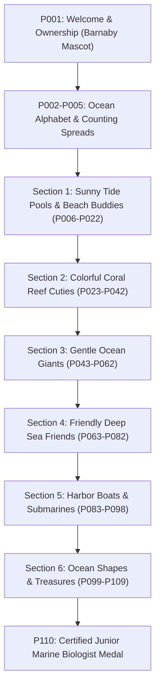
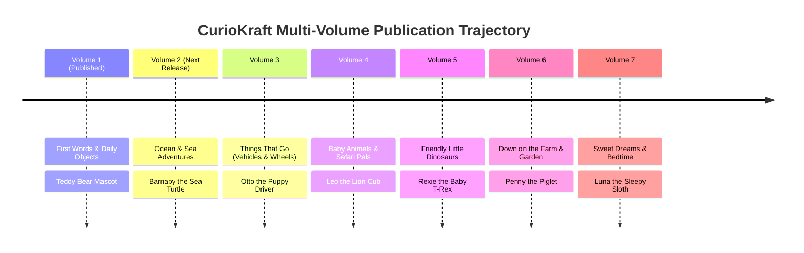

# CurioKraft Upcoming Volumes: Concepts, Themes & Series Roadmap

**Series Master Imprint:** CURIOKRAFT-KIDS  
**Core Brand Line:** *Tiny Hands Color & Learn*  
**Audience:** Toddlers & Preschoolers (Ages 1–4) & Their Parents / Caregivers  
**Format Standard:** 8.5" × 11.0", 300 DPI, 110 Pages, Black & White Line Art, Ultra-Thick Outlines (4–6pt)  
**Parent Guides:** [docs/MULTI_VOLUME_ARCHITECTURE_GUIDE.md](MULTI_VOLUME_ARCHITECTURE_GUIDE.md) | [docs/SPECIAL_PAGES_AND_MASCOT_GUIDE.md](SPECIAL_PAGES_AND_MASCOT_GUIDE.md)

---

## 🌟 Executive Summary

Following the completion and Amazon KDP certification of **Volume 1 (*Tiny Hands Color & Learn — First Words, Alphabet, Numbers & Everyday Objects*)**, this strategic roadmap defines the **Top 6 high-demand volume concepts** for subsequent releases in the CurioKraft publication catalog.

Each concept is engineered around CurioKraft's four core pillars:
1. **Age-Appropriate Visual Ergonomics (Ages 1–4):** Bold continuous outlines, single massive focal subjects, expansive white space, zero micro-textures or hatching, optimized for chunky crayons.
2. **Dual-Audience Value Split:** Immediate coloring joy and sensory gratification for toddlers, paired with vocabulary expansion, phonics, and developmental parent prompts ("Grown-Up Tips").
3. **Bookend Mascot Architecture:** Every volume features its own dedicated hero mascot who introduces the child on **Page 001 (Welcome & Ownership)** and awards the **Page 110 (Completion Certificate)**.
4. **Amazon KDP Commercial Dominance:** High organic search volume, evergreen giftability (birthdays, holidays, preschool prep), and clear differentiation against generic, thin-lined AI compilations.

---

## 📊 Concept Evaluation & Market Opportunity Matrix

| Rank | Volume Concept | Working Series Title | Hero Mascot Character | KDP Keyword Demand | Visual Toddler Fit | Production Complexity |
| :---: | :--- | :--- | :--- | :---: | :---: | :---: |
| **1** | **Ocean & Sea Adventures** *(Recommended Vol 2)* | *Tiny Hands Under the Sea & Ocean Friends* | **Barnaby the Baby Sea Turtle** | 🔥 **Very High** | ⭐⭐⭐⭐⭐ (Smooth curves, bubbles) | Low |
| **2** | **Things That Go: Wheels & Wings** | *Tiny Hands On the Move: Cars, Trucks & Planes* | **Otto the Puppy Driver** | 🔥 **Very High** | ⭐⭐⭐⭐⭐ (Geometric, wheels) | Low |
| **3** | **Baby Animals & Safari Pals** | *Tiny Hands Baby Animals & Sweet Cuties* | **Leo the Lion Cub** | 🚀 **Highest** | ⭐⭐⭐⭐⭐ (High emotional affinity) | Low |
| **4** | **Friendly Little Dinosaurs** | *Tiny Hands Dino Pals: Gentle Giants* | **Rexie the Baby T-Rex** | 🔥 **Very High** | ⭐⭐⭐⭐ (Needs non-scary styling) | Medium |
| **5** | **Down on the Farm & Garden** | *Tiny Hands Down on the Farm & Harvest Fun* | **Penny the Piglet** | 📈 **High** | ⭐⭐⭐⭐⭐ (Animals + Big Tractors) | Low |
| **6** | **Sweet Dreams & Cozy Bedtime** | *Tiny Hands Sweet Dreams: Stars & Sleepy Pals* | **Luna the Sleepy Sloth** | 📈 **High** | ⭐⭐⭐⭐⭐ (Soft circular shapes) | Low |

---

## 🌊 Concept 1: Ocean & Sea Adventures (Top Recommendation for Vol 2)

```text
┌─────────────────────────────────────────────────────────────────────────────┐
│ VOLUME 2: TINY HANDS UNDER THE SEA & OCEAN FRIENDS                          │
│ Subtitle: Big, Bold & Easy Sea Animals Coloring Book for Toddlers (Ages 1-4)│
│ Mascot: Barnaby the Baby Sea Turtle                                         │
└─────────────────────────────────────────────────────────────────────────────┘
```

### Why This Concept Dominates
"Toddler Ocean Coloring Book" and "Sea Animals for Toddlers" represent one of the most profitable, evergreen search niches on Amazon KDP. Marine life naturally features smooth, flowing silhouettes, circular bubbles, and waving sea grasses that are exceptionally satisfying for 2-year-olds learning wrist motor control.

### Hero Mascot: Barnaby the Baby Sea Turtle
- **Visual Design:** A friendly baby sea turtle with large curious round eyes, a smooth rounded shell with clean geometric hexagonal plates, smiling mouth, and cute flippers waving "hello."
- **Page 001 Welcome:** Barnaby peeking out of gentle sea waves with ocean bubbles, friendly starfishes, and a cute little sailor hat.
- **Page 110 Certificate:** Barnaby proudly holding up the golden Super Colorist medal surrounded by celebratory sea bubbles and floating coral ribbons.

### 110-Page Structural Architecture



#### Detailed Section Breakdown:
1. **Front Matter (Page 001):** *THIS BOOK BELONGS TO* with Barnaby the Turtle, sea bubbles, starfish, and ocean shell border.
2. **Educational Spreads (Pages 002–005):**
   - *P002–P003:* Ocean Alphabet A–Z Spread (A = Angel Fish, C = Crab, D = Dolphin, O = Octopus, S = Sea Turtle, W = Whale).
   - *P004–P005:* 1–10 Counting Spread (1 Giant Whale, 2 Playful Otters, 3 Sea Horses... 10 Tiny Pearl Bubbles).
3. **Section 1: Sunny Tide Pools & Beach Buddies (Pages 006–022):** Starfish, Hermit Crab, Seashell, Sand Dollar, Sandcastle, Sea Gull, Beach Ball, Pelican, Wading Egret.
4. **Section 2: Colorful Coral Reef Cuties (Pages 023–042):** Clownfish ("Nemo"), Seahorse, Yellow Tang, Coral Branch, Sea Anemone, Baby Pufferfish, Angelfish, Butterflyfish.
5. **Section 3: Gentle Ocean Giants (Pages 043–062):** Baby Blue Whale, Friendly Dolphin, Manta Ray, Sea Turtle, Manatee ("Sea Cow"), Gentle Whale Shark, Humpback Whale breaching with a water spout.
6. **Section 4: Friendly Deep Sea Friends (Pages 063–082):** Baby Octopus with 8 curly arms, Squiggly Squid, Friendly Anglerfish with soft glowing bulb, Jellyfish with smooth wavy tentacles, Nautilus, Sea Otter floating on back.
7. **Section 5: Harbor Boats & Submarines (Pages 083–098):** Yellow Submarine with periscope, Little Sailboat, Sturdy Tugboat, Fishing Boat, Lighthouse, Diving Mask, Anchor.
8. **Section 6: Ocean Shapes & Treasures (Pages 099–109):** Round Pearl, Ocean Wave, Five-Point Starfish, Sunken Treasure Chest (open with big coins), Scallop Shell.
9. **Back Matter (Page 110):** *SUPER COLORIST CERTIFICATE* — "Junior Ocean Explorer" signed by Grown-Up.

### Grown-Up Developmental Focus
- **Parent Conversation Prompts:** "What sound does the ocean make?", "Can you find the starfish with 5 arms?", "Which animal swims fast?"
- **Motor Development:** Wavy line coloring, filling circular bubble clusters, bilateral coordination.

---

## 🚗 Concept 2: Things That Go: Cars, Trucks, Planes & Big Wheels

```text
┌─────────────────────────────────────────────────────────────────────────────┐
│ VOLUME 3: TINY HANDS ON THE MOVE — CARS, TRUCKS & BIG WHEELS               │
│ Subtitle: Simple & Fun Vehicles, Trains & Planes for Toddlers (Ages 1-4)    │
│ Mascot: Otto the Puppy Driver                                               │
└─────────────────────────────────────────────────────────────────────────────┘
```

### Why This Concept Dominates
"Things That Go" is the #1 highest-velocity gift category for toddlers (boys and girls alike). Toddlers love dynamic sounds (*Vroom, Beep, Choo-Choo, Wee-Woo*) and bold mechanical shapes with prominent circular wheels.

### Hero Mascot: Otto the Puppy Driver
- **Visual Design:** A cheerful puppy with floppy ears and a driver's cap sitting proudly behind the steering wheel of a cute little vintage roadster.
- **Page 001 Welcome:** Otto waving from his car with checkered flags, traffic cones, and friendly clouds.
- **Page 110 Certificate:** Otto celebrating with a giant Golden Steering Wheel / Super Driver trophy and confetti.

### 110-Page Structural Architecture
1. **Front Matter (Page 001):** *THIS BOOK BELONGS TO* (Otto in car, road border, stoplight).
2. **Educational Spreads (Pages 002–005):**
   - *P002–P003:* Vehicle ABCs (A = Airplane, B = Bus, C = Concrete Mixer, F = Fire Engine, T = Train).
   - *P004–P005:* 1–10 Counting (1 Locomotive, 2 Big Trucks, 3 Helicopters... 10 Traffic Signs).
3. **Section 1: Daily Neighborhood Wheels (Pages 006–022):** Family Sedan, School Bus, Bicycle with basket, Kick Scooter, City Taxi, Mail Truck, Ice Cream Van.
4. **Section 2: Mighty Construction Machines (Pages 023–042):** Big Dump Truck, Hydraulic Excavator, Bulldozer pushing dirt, Cement Mixer with spiral drum, Road Roller, Forklift.
5. **Section 3: Community Heroes & Rescue Vehicles (Pages 043–060):** Big Red Fire Engine with ladder, Police Patrol Car, Emergency Ambulance, Coast Guard Rescue Helicopter.
6. **Section 4: Tracks, Rails & Locomotives (Pages 061–078):** Puffer Steam Train, Modern High-Speed Bullet Train, Streetcar / Tram, Coal Car, Caboose, Railroad Crossing Gate.
7. **Section 5: High in the Sky (Pages 079–094):** Passenger Jetliner, Propeller Biplane, Hot Air Balloon with basket, Blimp, Space Shuttle / Rocket, Parachute.
8. **Section 6: Waterways & Harbors (Pages 095–109):** Little Ferry, Tugboat with smoke stack, Speedboat, Cargo Container Ship, Kayak with paddle.
9. **Back Matter (Page 110):** *SUPER COLORIST CERTIFICATE* — "Chief Driver & Master Builder."

---

## 🦁 Concept 3: Baby Animals: Safari, Farm & Forest Cuties

```text
┌─────────────────────────────────────────────────────────────────────────────┐
│ VOLUME 4: TINY HANDS BABY ANIMALS — SWEET & FLUFFY CUTIES                   │
│ Subtitle: Big & Easy Animal Babies Coloring Book for Toddlers (Ages 1-4)    │
│ Mascot: Leo the Lion Cub                                                    │
└─────────────────────────────────────────────────────────────────────────────┘
```

### Why This Concept Dominates
Baby animals possess universal emotional appeal. "Baby Animals Coloring Book" captures both impulse parent purchases and high-volume grandparent gifting. Toddlers naturally connect with large innocent eyes and chubby silhouettes.

### Hero Mascot: Leo the Lion Cub
- **Visual Design:** A cuddly little lion cub with a tiny tuft of mane, round ears, and a playful smile, sitting upright like a plush toy.
- **Page 001 Welcome:** Leo hugging a giant alphabet block surrounded by playful animal paw prints and butterflies.
- **Page 110 Certificate:** Leo proudly wearing an animal ranger sash and holding the golden Super Colorist medal.

### 110-Page Structural Architecture
1. **Front Matter (Page 001):** *THIS BOOK BELONGS TO* (Leo, paw prints, playful safari vines).
2. **Educational Spreads (Pages 002–005):**
   - *P002–P003:* Baby Animal Alphabet (C = Calf, D = Duckling, F = Foal, L = Lamb, P = Piglet).
   - *P004–P005:* 1–10 Counting (1 Baby Elephant, 2 Baby Bunnies, 3 Playful Kittens... 10 Busy Honeybees).
3. **Section 1: Sunny Farmyard Babies (Pages 006–024):** Fluffy Lamb, Muddy Piglet, Yellow Duckling, Little Foal, Baby Calf, Fluffy Chick, Baby Goat (Kid).
4. **Section 2: Woodland & Forest Nursery (Pages 025–044):** Spotted Fawn, Baby Bunny with carrot, Little Raccoon, Playful Fox Kit, Chubby Bear Cub, Hedgehog with soft quills.
5. **Section 3: Wild Safari & Jungle Cubs (Pages 045–066):** Baby Elephant spraying water, Giraffe Calf with long neck, Hippo Calf, Little Chimpanzee, Baby Zebra with stripes.
6. **Section 4: Arctic & Cold Weather Cuddles (Pages 067–084):** Fluffy Emperor Penguin Chick, White Harp Seal Pup, Polar Bear Cub on ice, Snowshoe Hare, Arctic Puffin.
7. **Section 5: Household Pet Pals (Pages 085–098):** Sleepy Kitten with yarn, Bouncy Puppy with tennis ball, Little Hamster in wheel, Lop-Eared Bunny, Goldfish in bowl.
8. **Section 6: Tree Canopy & Garden Friends (Pages 099–109):** Wide-Eyed Baby Owl, Chirping Bluebird, Monarch Butterfly, Red Ladybug, Fuzzy Bumblebee.
9. **Back Matter (Page 110):** *SUPER COLORIST CERTIFICATE* — "Certified Animal Ranger & Kind Friend."

---

## 🦖 Concept 4: Little Dinosaurs & Prehistoric Pals (Gentle Giants)

```text
┌─────────────────────────────────────────────────────────────────────────────┐
│ VOLUME 5: TINY HANDS DINO PALS — GENTLE PREHISTORIC GIANTS                  │
│ Subtitle: Cute, Friendly & Non-Scary Dinosaurs for Toddlers (Ages 1-4)       │
│ Mascot: Rexie the Baby T-Rex                                                │
└─────────────────────────────────────────────────────────────────────────────┘
```

### Why This Concept Dominates
Existing dinosaur coloring books on Amazon are overwhelmingly aimed at ages 6–10, filled with sharp predatory teeth, scary expressions, and muddy cross-hatching. A **strictly non-scary, rounded, friendly dinosaur book** for ages 1–4 fills an underserved market gap with enormous organic search volume.

### Hero Mascot: Rexie the Baby T-Rex
- **Visual Design:** A chubby, smiling baby tyrannosaurus with huge round eyes, tiny smooth hands clapping with joy, two blunt round baby teeth, and a happy wagging tail.
- **Page 001 Welcome:** Rexie popping out of a giant cracked dinosaur egg surrounded by tropical palm leaves.
- **Page 110 Certificate:** Rexie holding the Super Colorist medal with prehistoric ferns and golden star sparkles.

### 110-Page Structural Architecture
1. **Front Matter (Page 001):** *THIS BOOK BELONGS TO* (Rexie hatching, leafy border, dino footprints).
2. **Educational Spreads (Pages 002–005):**
   - *P002–P003:* Dino Alphabet (A = Ankylosaurus, B = Brachiosaurus, S = Stegosaurus, T = Triceratops).
   - *P004–P005:* 1–10 Dino Counting (1 Friendly T-Rex, 2 Long Necks, 3 Spiky Stegos... 10 Shiny Dino Eggs).
3. **Section 1: Gentle Long-Necks & Big Eaters (Pages 006–024):** Baby Brachiosaurus munching treetops, Apatosaurus drinking from pond, Diplodocus sliding down a hill.
4. **Section 2: Armored Friends & Horned Cuties (Pages 025–044):** Baby Triceratops with 3 smooth blunt horns, Stegosaurus with big rounded plates, Ankylosaurus with club tail.
5. **Section 3: Dino Babies & Hatchlings (Pages 045–064):** Dino Baby sleeping in nest, Twins peeking from eggs, Baby Parasaurolophus with trumpet crest, Dino Mom with baby.
6. **Section 4: Sky Gliders & Water Swimmers (Pages 065–080):** Cute Pterodactyl gliding on clouds, Baby Plesiosaur swimming with bubbles, Friendly Ichthyosaur.
7. **Section 5: Prehistoric World & Daily Play (Pages 081–096):** Smiling Cartoon Volcano puffing heart smoke, Giant Prehistoric Fern, Dino Footprint in mud, Shiny Amber Pebble.
8. **Section 6: Dino Shapes & Adventures (Pages 097–109):** Oval Dino Egg, Palm Leaf Silhouette, Prehistoric Sun, Dino Slide in playground.
9. **Back Matter (Page 110):** *SUPER COLORIST CERTIFICATE* — "Junior Dino Discovery Explorer."

---

## 🚜 Concept 5: Down on the Farm & Garden Harvest

```text
┌─────────────────────────────────────────────────────────────────────────────┐
│ VOLUME 6: TINY HANDS DOWN ON THE FARM — ANIMALS, TRACTORS & HARVEST        │
│ Subtitle: Simple Barnyard Life & Garden Fun for Toddlers (Ages 1-4)         │
│ Mascot: Penny the Playful Piglet                                            │
└─────────────────────────────────────────────────────────────────────────────┘
```

### Why This Concept Dominates
"Down on the Farm" connects directly to early childhood curriculum in nursery and preschool settings (Old MacDonald, farm animal sounds, where fresh food comes from). It blends two high-performing themes: **Farm Animals** and **Heavy Farm Machinery**.

### Hero Mascot: Penny the Playful Piglet
- **Visual Design:** A chubby little piglet with a curly spiral tail, floppy ears, and a cute round snout, wearing little denim overalls or a straw hat.
- **Page 001 Welcome:** Penny sitting next to a big red barn door with sunflower stalks and wooden fence borders.
- **Page 110 Certificate:** Penny holding the Super Colorist ribbon badge with golden wheat stalks and farm ribbons.

### 110-Page Structural Architecture
1. **Front Matter (Page 001):** *THIS BOOK BELONGS TO* (Penny, picket fence, sunflowers).
2. **Educational Spreads (Pages 002–005):**
   - *P002–P003:* Farm ABCs (B = Barn, C = Cow, H = Horse, S = Sheep, T = Tractor).
   - *P004–P005:* 1–10 Farm Counting (1 Big Red Barn, 2 Proud Horses, 3 Woolly Sheep... 10 Ripe Red Apples).
3. **Section 1: Barnyard Animals (Pages 006–025):** Spotted Dairy Cow, Woolly Sheep, Mother Hen & Chicks, Proud Rooster, Gentle Farm Horse, Playful Goat, Farm Dog.
4. **Section 2: Big Farm Machinery (Pages 026–044):** Classic Red Tractor, Hay Baler, Grain Combine, Wooden Hay Wagon, Windmill with rotating blades, Farm Silo.
5. **Section 3: Fresh Garden Patch & Orchard (Pages 045–066):** Giant Round Pumpkin, Sweet Strawberry Bush, Crunchy Carrot in soil, Ripe Watermelon, Tall Sunflower, Apple Tree with basket.
6. **Section 4: The Farm Pond (Pages 067–082):** Mother Duck with ducklings swimming, Green Frog on lily pad, Dragonfly, Catfish, Reeds and cattails.
7. **Section 5: Daily Country Life (Pages 083–096):** Scarecrow with patched overalls, Wooden Wheelbarrow, Watering Can with water drops, Fresh Egg Basket, Glass Jug of Milk.
8. **Section 6: Farm Shapes & Weather (Pages 097–109):** Horseshoe, Weather Vane Rooster, Hay Bale Cylinder, Bright Country Sun.
9. **Back Matter (Page 110):** *SUPER COLORIST CERTIFICATE* — "Certified Junior Farmer & Harvester."

---

## 🌙 Concept 6: Sweet Dreams & Cozy Bedtime (Calming Evening Activity)

```text
┌─────────────────────────────────────────────────────────────────────────────┐
│ VOLUME 7: TINY HANDS SWEET DREAMS — STARS, MOON & SLEEPY PALS               │
│ Subtitle: Gentle & Calming Bedtime Coloring Book for Toddlers (Ages 1-4)    │
│ Mascot: Luna the Sleepy Sloth                                               │
└─────────────────────────────────────────────────────────────────────────────┘
```

### Why This Concept Dominates
Parents actively seek calming, screen-free nighttime activities to replace tablets before bed. While most coloring books are high-energy, *Sweet Dreams* is positioned as a **sensory wind-down ritual**, featuring sleepy characters, soft cloud shapes, and soothing nighttime motifs that reduce stimulation.

### Hero Mascot: Luna the Sleepy Sloth
- **Visual Design:** A sweet, slow-moving baby sloth with closed happy eyes, wearing a little nightcap with a hanging pom-pom, hugging a soft crescent moon.
- **Page 001 Welcome:** Luna dozing comfortably on a fluffy cloud with dangling stars and a gentle smiling moon.
- **Page 110 Certificate:** Luna holding a glowing Star Medal surrounded by soft dream clouds and sleeping sheep.

### 110-Page Structural Architecture
1. **Front Matter (Page 001):** *THIS BOOK BELONGS TO* (Luna on cloud, pillow, twinkling stars).
2. **Educational Spreads (Pages 002–005):**
   - *P002–P003:* Bedtime ABCs (B = Blanket, C = Cloud, M = Moon, P = Pillow, S = Star).
   - *P004–P005:* 1–10 Counting (1 Crescent Moon, 2 Warm Slippers, 3 Sleeping Sheep... 10 Twinkling Night Stars).
3. **Section 1: Night Sky Wonders (Pages 006–024):** Smiling Crescent Moon, Giant Glowing Star, Fluffy Night Cloud, Shooting Star with smooth trail, Friendly Planet with rings.
4. **Section 2: Sleepy Woodland Critters (Pages 025–044):** Little Owl sleeping in tree hollow, Curled-up Red Fox, Sleepy Bear in cave with blanket, Little Hedgehog in autumn leaves, Dozing Koala on branch.
5. **Section 3: Cozy Bedtime Rituals (Pages 045–066):** Warm Mug of Milk, Storybook open on pillow, Pair of Bunny Slippers, Soft Nightlight lamp, Pajamas with star pattern, Toothbrush & bubble.
6. **Section 4: Gentle Magic & Lullabies (Pages 067–084):** Baby Unicorn sleeping under rainbow, Star Fairy sprinkling sleep dust, Floating Cloud Castle, Hanging Crib Mobile with wooden stars.
7. **Section 5: Stuffed Animal Friends (Pages 085–098):** Vintage Teddy Bear with blanket, Ragdoll sleeping, Plush Bunny with long ears, Soft Yarn Ball.
8. **Section 6: Morning Sunrise & Gentle Wake-Up (Pages 099–109):** Gentle Smiling Morning Sun, Singing Morning Bird, Fresh Flower opening with dewdrop, Window with sunbeams.
9. **Back Matter (Page 110):** *SUPER COLORIST CERTIFICATE* — "Certified Sweet Dreamer & Star Colorist."

---

## 🎯 Strategic Release Sequencing Recommendation

To maximize brand recognition, cross-selling across volumes, and Amazon algorithm momentum, the recommended publication sequence is:



### Why Ocean (Volume 2) is the Optimal Next Release:
1. **Direct Contrast with Volume 1:** Vol 1 covered terrestrial daily objects, animals, and fruits. Vol 2 transitions completely into a magical underwater environment, preventing customer perceived overlap.
2. **Visual Simplicity & Flow:** Marine animals (whales, turtles, fish) have natural, continuous, bulbous contours with minimal angular joints, making prompt generation and AI studio rendering exceptionally reliable.
3. **High Giftability & Universal Appeal:** Ocean themes are 100% gender-neutral and favored by Montessori and Waldorf preschool communities worldwide.

---

## 🛠️ Technical Execution Blueprint for Volume 2 Launch

When you are ready to initiate production of Volume 2, execute the following standardized steps:

### 1. Create the Volume 2 Manifest
Duplicate and customize the manifest:
```powershell
Copy-Item manifest/pages.json manifest/pages_vol2.json
```
Update `book_title`, `subtitle`, and the 110 page items matching the Ocean Architecture above.

### 2. Set Up the Dedicated Mascot & Special Assets
Create the isolated asset directory:
```powershell
New-Item -ItemType Directory -Force inbox/special_assets_vol2
```
Generate the 7 modular assets in Google AI Studio / Imagen:
- `tiny_mascot.png`: Barnaby the baby sea turtle
- `super_colorist_badge.png`: Ocean seashell & starfish medal
- `welcome_scene.png`: Coral clusters, sea bubbles, sea shells, swimming baby fish
- `celebration_scene.png`: Water bubbles, floating sea ribbons, starbursts
- `crayons.png`: Crayons bundle with gentle wavy water ripples

### 3. Generate Prompts via Multi-Agent Specialist Debates
Run the deterministic prompt generator:
```powershell
.\.venv\Scripts\curiokraft-book debate export --manifest manifest/pages_vol2.json --output generated/prompts_vol2.json
```

### 4. Build Special Pages & Interior PDF
```powershell
.\.venv\Scripts\curiokraft-book generate special-pages --assets-dir inbox/special_assets_vol2/
.\.venv\Scripts\curiokraft-book pdf compile
.\.venv\Scripts\curiokraft-book preflight run
```

### 5. Build CMYK Cover Wrap
```powershell
.\.venv\Scripts\curiokraft-book cover build
```

---

*CurioKraft Publications — Engineering Publishing-House Quality Through AI Precision & Deterministic Code.*
