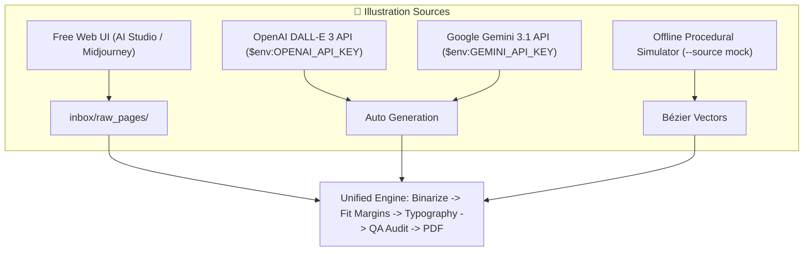
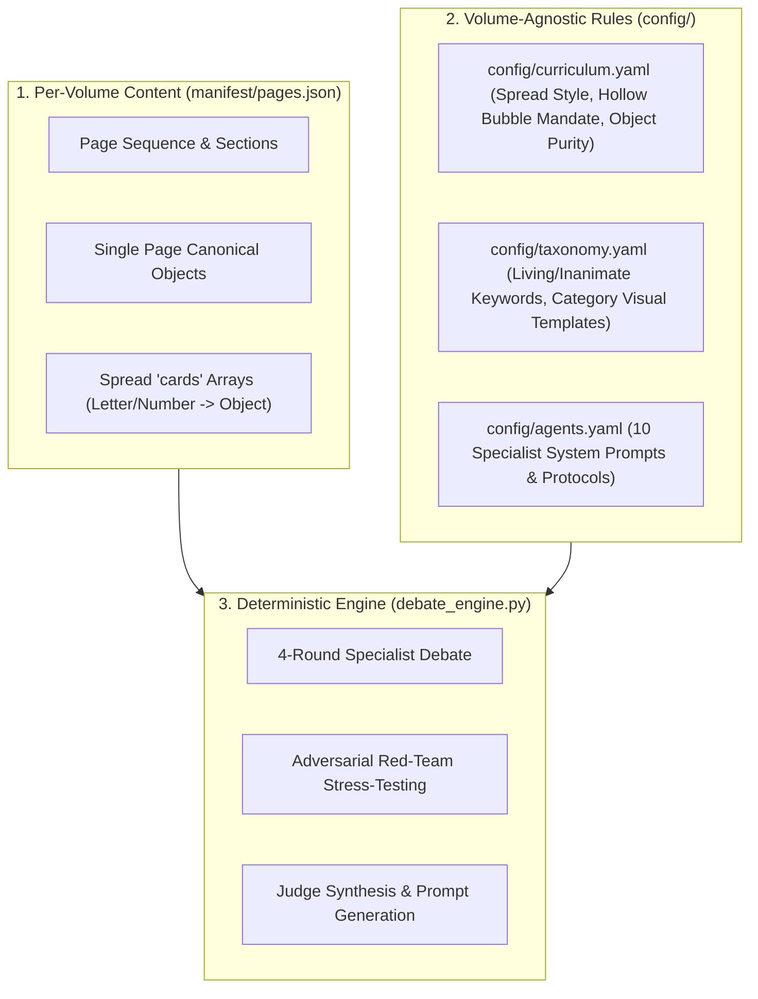

# CurioKraft Coloring Book Production System — User Guide

**Edition:** Vol 1.0 (Amazon KDP Paperback 8.5 × 11 in)  
**Publisher Imprint:** CURIOKRAFT-KIDS  
**CLI Package:** `curiokraft-coloring-book` (`curiokraft-book` / `ck-publish`)

---

## 1. Categorized CLI Command Map

The commands are divided into **two distinct operational tracks**:
1. 🧪 **Code Quality & Health Verification:** Fast local tests, doctor checks, and manifest audits (0 API cost, run anytime).
2. 🚀 **Book Production & Assembly:** Sample visual review, batch generation, cover compositing, and print PDF compilation.

```text
┌─────────────────────────────────────────────────────────────────────────────┐
│                           CURIOKRAFT CLI COMMAND MAP                        │
├─────────────────────────────────────────────────────────────────────────────┤
│ 🧪 TRACK A: CODE QUALITY, HEALTH & MANIFESTS                                │
│   • curiokraft-book doctor             ──► Check assets, fonts & active AI  │
│   • curiokraft-book test validators    ──► Run automated unit test suite    │
│   • curiokraft-book manifest audit     ──► Verify 0 duplicate collisions    │
│   • curiokraft-book manifest status    ──► Inspect 110-page lifecycle state │
│   • curiokraft-book cover validate     ──► Diagnostic check on cover size   │
├─────────────────────────────────────────────────────────────────────────────┤
│ 🚀 TRACK B: BOOK GENERATION & ASSEMBLY                                      │
│   • curiokraft-book init               ──► Scaffold directories & templates │
│   • curiokraft-book sample generate    ──► Visual check (1-5 pages, Gate 2) │
│   • curiokraft-book generate book      ──► Full 110-page production batch   │
│   • curiokraft-book cover build        ──► Build 17.498x11.250" cover       │
│   • curiokraft-book assemble interior  ──► Compile 110-page print PDF       │
│   • curiokraft-book preflight run      ──► Official 18-point certificate    │
└─────────────────────────────────────────────────────────────────────────────┘
```

---

## 2. Step-by-Step Publishing Lifecycle Guide

Execute the commands in this exact sequential order for every publication run:

| Step # | Command | Category | Purpose & Output | Next Step on Success | Recovery on Failure |
| :---: | :--- | :--- | :--- | :--- | :--- |
| **0** | `curiokraft-book init` | Setup | Scaffolds `assets/`, `manifest/`, `config/`, `output/` folders. | `curiokraft-book doctor` | Check folder write permissions. |
| **1** | `curiokraft-book doctor` | Quality | Audits workspace health, detects `curiokraft_logo.png`, `curiokraft_emblem.png`, and `Fredoka-Bold.ttf`. | `curiokraft-book test validators` | Drop missing assets into `assets/` subdirectories. |
| **2** | `curiokraft-book test validators` | Quality | Executes pytest unit tests verifying dimension, margin, grayscale, and Otsu rescue algorithms. | `curiokraft-book manifest audit` | Run `pytest tests/ -vv` to inspect failure logs. |
| **3** | `curiokraft-book manifest audit` | Quality | Scans `manifest/objects.json` verifying 0 semantic collisions across 143 items. | `curiokraft-book sample generate --count 3` | Fix duplicate words in `manifest/objects.json`. |
| **4** | `curiokraft-book sample generate --count 3` | Visual Gate | Generates 3 sample pages in `output/samples/` for visual style sign-off (Gate 2). | `curiokraft-book generate book` | Verify API key or test in `$env:CK_DEFAULT_PROVIDER="mock"`. |
| **5** | `curiokraft-book generate book` | Production | Executes 4-round multi-agent debate, code rescue, and vector typography across all 110 pages in `output/interior_masters/`. | `curiokraft-book cover build` | Run `curiokraft-book manifest status` to see flagged pages. |
| **6** | `curiokraft-book cover build` | Production | Composites $17.498 \times 11.250\text{ in}$ cover PNG and CMYK PDF with $0.248\text{ in}$ spine and barcode safe zone. | `curiokraft-book assemble interior` | Verify `assets/logo/` and `assets/emblem/` image integrity. |
| **7** | `curiokraft-book assemble interior` | Production | Compiles all 110 master PNGs into `output/interior/TINY_HANDS_COLOR_AND_LEARN_Interior_110p.pdf`. | `curiokraft-book preflight run` | Ensure all 110 pages exist in `output/interior_masters/`. |
| **8** | `curiokraft-book preflight run` | Certification | Executes full 18-point diagnostic and writes official `output/reports/FINAL_KDP_PREFLIGHT_CERTIFICATE.txt`. | **PUBLISH TO KDP!** | Inspect failed check numbers in preflight table. |

---

## 3. Detailed Command Reference

### 🧪 Track A: Code Quality & Health Commands

#### 1. `curiokraft-book doctor`
Runs a real-time diagnostic of your workspace, assets, font priority, and active AI model.
```powershell
curiokraft-book doctor
```

#### 2. `curiokraft-book test validators`
Runs automated unit tests for dimensions, margins, Otsu binarizer, and PDF validators without generating book pages.
```powershell
curiokraft-book test validators
```

#### 3. `curiokraft-book manifest audit`
Validates that all 143 vocabulary items in `manifest/objects.json` are unique and collision-free.
```powershell
curiokraft-book manifest audit
```

#### 4. `curiokraft-book manifest status`
Displays a live summary table of the 110-page pipeline state machine (`PLANNED`, `GENERATED`, `RESCUED`, `APPROVED`).
```powershell
curiokraft-book manifest status
```

---

### 🚀 Track B: Book Production & Assembly Commands

#### 1. `curiokraft-book sample generate`
Generates 1 to 5 sample master pages for Gate 2 visual approval before running the full batch.
```powershell
# Generate 3 representative sample pages (default)
curiokraft-book sample generate --count 3

# Or select specific page IDs
curiokraft-book sample generate --pages P001,P005,P047
```
- **Output:** `output/samples/P001_master.png`, `output/samples/P005_master.png`, `output/samples/P047_master.png`.

#### 2. `curiokraft-book generate book`
Executes the full production batch for all 110 pages:
1. Runs 4-round multi-agent debate (Director, Design, KDP, Market, Edu, Critic, Judge).
2. Generates raster artwork.
3. Applies adaptive Otsu code rescue & margin centering.
4. Overlays vector uppercase typography (`Fredoka-Bold.ttf`).
5. Audits whole-book sequence via `AGT-010-BOOKQA`.
```powershell
curiokraft-book generate book
```
- **Output:** `output/interior_masters/page_001.png` through `page_110.png`.

#### 3. `curiokraft-book cover build`
Programmatically composites the complete KDP paperback full-wrap cover:
- **Canvas Size:** $17.498 \times 11.250\text{ in}$ ($5249 \times 3375\text{ px} @ 300\text{ DPI}$).
- **Spine Width:** $0.248\text{ in}$ ($74.4\text{ px}$).
- **Barcode Box:** $2.0 \times 1.2\text{ in}$ reserved clean zone on back cover lower-right.
```powershell
curiokraft-book cover build
```
- **Output:** `output/cover/TINY_HANDS_COLOR_AND_LEARN_Cover_300DPI.png` & `output/cover/TINY_HANDS_COLOR_AND_LEARN_Cover_CMYK.pdf`.

#### 4. `curiokraft-book assemble interior`
Compiles all 110 composited PNG masters into a print-ready 8.5×11" PDF.
```powershell
curiokraft-book assemble interior
```
- **Output:** `output/interior/TINY_HANDS_COLOR_AND_LEARN_Interior_110p.pdf`.

#### 5. `curiokraft-book preflight run`
Executes all 18 deterministic Amazon KDP preflight checks and issues the official certification report.
```powershell
curiokraft-book preflight run
```
- **Output:** `output/reports/FINAL_KDP_PREFLIGHT_CERTIFICATE.txt`.

---

## 4. Amazon KDP Safe Area, Gutter & Trim Specifications

Every page in our 110-page coloring book strictly satisfies and exceeds Amazon KDP's technical print requirements:

### 📐 Master Geometry Reference Table (8.5 × 11.0 in, No Bleed, 110 Pages)

| Dimension Metric | Amazon KDP Minimum | CurioKraft Enforced Standard | Protection Margin |
| :--- | :--- | :--- | :--- |
| **Page Dimensions** | $8.50 \times 11.00\text{ in}$ | **$8.50 \times 11.00\text{ in}$ ($2550 \times 3300\text{ px}$)** | Exact US Letter standard |
| **Inside Gutter Margin (Spine)** | $0.375\text{ in}$ ($113\text{ px}$) | **$0.500\text{ in} \dots 0.660\text{ in}$ ($150 \dots 200\text{ px}$)** | **+33% to +75% extra clearance** beyond Amazon minimum |
| **Outside Margin (Outer edge)** | $0.250\text{ in}$ ($75\text{ px}$) | **$0.500\text{ in}$ ($150\text{ px}$)** | **+100% extra clearance** against trim shift |
| **Top Margin (Header space)** | $0.250\text{ in}$ ($75\text{ px}$) | **$0.800\text{ in}$ ($240\text{ px}$)** | Spacious breathing room for bubble typography |
| **Bottom Margin (Footer space)** | $0.250\text{ in}$ ($75\text{ px}$) | **$0.500\text{ in}$ ($150\text{ px}$)** | Prevents cutting edge damage |
| **Resolution** | 300 DPI | **300 DPI (Lossless PNG & PDF)** | Zero compression degradation |
| **Color Mode** | Grayscale / B&W | **100% Pure Binary Line Art ($0\text{ or }255$)** | Zero gray shading, pure coloring lines |

### 📖 Visual Spread Diagram: Gutter & Safe Live Area Layout

```text
=============================================================================================================
                                     OPEN 2-PAGE SPREAD (17.0 x 11.0 in)
=============================================================================================================
 ◄─────── LEFT-HAND PAGE (Even / Verso) ─────────► ║ ◄──────── RIGHT-HAND PAGE (Odd / Recto) ────────►
 ┌───────────────────────────────────────────────┬─║─┬───────────────────────────────────────────────┐
 │ 0.50" Top Safe Margin                         │ ║ │ 0.50" Top Safe Margin                         │
 │ ┌───────────────────────────────────────────┐ │ ║ │ ┌───────────────────────────────────────────┐ │
 │ │                                           │ │ ║ │ │ [Zone 1: BUBBLE WORD HEADER]              │ │
 │ │                                           │ │ ║ │ │ Y = 240 px (0.80") | 230pt Colorable Font │ │
 │ │                                           │ │ ║ │ │              E L E P H A N T              │ │
 │ │                                           │ │ ║ │ ├───────────────────────────────────────────┤ │
 │ │                                           │ │ ║ │ │                                           │ │
 │ │           LEFT PAGE / BLEED GUARD         │ │ ║ │ │ [Zone 2: MAIN ILLUSTRATION AREA]          │ │
 │ │        (Blank or Light Patterned)         │ │ ║ │ │ Y = 600 px to 3100 px (Centered)          │ │
 │ │                                           │ │ ║ │ │                                           │ │
 │ │                                           │ │ ║ │ │            [ CUTE CHUNKY ]                │ │
 │ │                                           │ │ ║ │ │            [ TODDLER ART ]                │ │
 │ │                                           │ │ ║ │ │                                           │ │
 │ │                                           │ │ ║ │ │                                           │ │
 │ └───────────────────────────────────────────┘ │ ║ │ └───────────────────────────────────────────┘ │
 │ 0.50" Bottom Safe Margin                      │ ║ │ 0.50" Bottom Safe Margin                      │
 └───────────────────────────────────────────────┴─║─┴───────────────────────────────────────────────┘
 ◄─────── 0.50" ──────►◄──────── 0.50" ────────►   ║   ◄──────── 0.50" ────────►◄─────── 0.50" ──────►
   Outside Trim Edge       GUTTER (SPINE)          ║       GUTTER (SPINE)          Outside Trim Edge
  (Mechanical Blade)   (Inside Binding Glue)       ║   (Inside Binding Glue)      (Mechanical Blade)
                                                   ║
                                           CENTER SPINE FOLD
```

### 📖 Gutter & Binding Mechanics

- **Odd Pages (Right-Hand / Recto, e.g. Page 1, 3, 5...):** The binding glue is on the **LEFT side**. Our engine enforces $\ge 0.50\text{ in}$ ($150\text{ px}$) on the left so ink is never pulled into the spine curve.
- **Even Pages (Left-Hand / Verso, e.g. Page 2, 4, 6...):** The binding glue is on the **RIGHT side**.
- **Toddler Single-Sided Coloring:** All main coloring illustrations sit on the **Right-Hand pages**, guaranteeing flat, easy coloring with zero spine interference.
- **Automated Preflight Guarantee:** The `curiokraft-book preflight run` command programmatically evaluates every page with `validate_margins()` to guarantee 100% KDP compliance before submission.

### 🔤 Preschool Typography Sizing & Letter Spacing Matrix

At **300 DPI print resolution** ($2550 \times 3300\text{ px}$, $8.5 \times 11.0\text{ in}$), the typography engine dynamically computes font height and inter-character letter spacing (tracking) based on word length:

| Category / Word Length | Example Words | Font Size (Points) | Letter Height (Pixels / Inches) | Inter-Letter Spacing (Tracking) | Outline Stroke Width |
| :--- | :--- | :---: | :---: | :---: | :---: |
| **Short Words** ($\le 5$ chars) | `CAT`, `DOG`, `COW`, `CAR`, `BOAT` | **`265 pt`** | **$360\text{ px}$** ($1.20\text{ in}$) | **`46 px`** ($0.15\text{ in}$) | `15 px` ($0.05\text{ in}$) |
| **Medium Words** ($6\text{--}8$ chars) | `BANANA`, `ELEPHANT`, `MONKEY` | **`245 pt`** | **$330\text{ px}$** ($1.10\text{ in}$) | **`40 px`** ($0.13\text{ in}$) | `15 px` ($0.05\text{ in}$) |
| **Long Words** ($9\text{--}11$ chars) | `STRAWBERRY`, `WATERMELON` | **`200 pt`** | **$270\text{ px}$** ($0.90\text{ in}$) | **`30 px`** ($0.10\text{ in}$) | `15 px` ($0.05\text{ in}$) |
| **Very Long Words** ($12\text{--}15$ chars) | `TRACTOR TRAILER`, `HELICOPTER` | **`166 pt`** | **$225\text{ px}$** ($0.75\text{ in}$) | **`24 px`** ($0.08\text{ in}$) | `15 px` ($0.05\text{ in}$) |
| **Spread Titles** ($16+$ chars) | `A - M FIRST WORDS`, `NUMBERS 0 - 5` | **`135 pt`** | **$180\text{ px}$** ($0.60\text{ in}$) | **`20 px`** ($0.07\text{ in}$) | `15 px` ($0.05\text{ in}$) |

- **Top Offset:** $240\text{ px}$ ($0.80\text{ in}$) from top trim edge.
- **Hollow Bubble Style:** Pure white interior (`fill=255`) with bold black outline (`stroke_width=15 px`).
- **Safety Margin Guarantee:** $\ge 175\text{ px}$ ($0.58\text{ in}$) side buffer, exceeding KDP requirements.

---

## 5. Pluggable Illustration Providers & Execution Modes

CurioKraft features a fully decoupled, pluggable image provider architecture:



### 🆓 Mode 1: 100% Free Google AI Studio Web Workflow (Zero API Cost)
Use this workflow if you do not want to be billed for developer API keys:
1. **Get the Optimized Prompt:**
   ```powershell
   curiokraft-book prompt show --page P005
   # Or export all 110 prompts at once:
   curiokraft-book prompt export --out generated/prompts_export.md
   ```
2. **Generate in Google AI Studio Web UI:**
   - Open [Google AI Studio](https://aistudio.google.com) (or Gemini Chat / Google One).
   - Paste the prompt and click generate.
   - Save the downloaded PNG into: `inbox/raw_pages/raw_p005_banana.png` (or `inbox/raw_pages/banana.png`).
3. **Ingest & Validate:**
   ```powershell
   # Ingest all new dropped files from inbox (clears inbox & creates certified masters):
   curiokraft-book ingest

   # Or run sample validation:
   curiokraft-book sample generate --pages P005 --source inbox
   ```

---

### 🤖 Mode 2: Automated OpenAI DALL-E 3 API
If you have an OpenAI account with API credits:
```powershell
$env:OPENAI_API_KEY = "sk-proj-..."
curiokraft-book sample generate --count 3 --source openai
curiokraft-book generate book --source openai
```

---

### ⚡ Mode 3: Automated Google Gemini Image API (Requires Linked Billing)
Google requires a Pay-As-You-Go billing account linked in Google AI Studio for image models (`gemini-3.1-flash-image`):
```powershell
$env:GEMINI_API_KEY = "AIzaSy..."
curiokraft-book sample generate --count 3 --source gemini
curiokraft-book generate book --source gemini
```

---

### 🧪 Mode 4: Offline Testing Simulator (Zero Cost Bézier Curves)
For layout checks, CI/CD, and offline development:
```powershell
curiokraft-book sample generate --count 3 --source mock
```

---

## 6. CLI Execution Flags (`--source` & `--force`)

| Flag | Values | Description |
| :--- | :--- | :--- |
| `--source`, `-s` | `auto`, `api`, `inbox`, `disk`, `mock`, `openai`, `gemini` | Selects where illustrations originate. Defaults to `auto`. |
| `--force`, `-f` | Flag (boolean) | Bypasses existing caches and forces fresh generation. |
| `--pages`, `-p` | `P001,P005,P047` | Target specific page IDs for testing. |
| `--clear / --keep` | Flag | On `curiokraft-book ingest`, moves processed files to `generated/raw_pages/` to prevent stale re-ingestion. |

---

## 7. Dual-Layer Observability & Multi-Agent Debate Audit

- **Terminal Output:** High-impact progress bars, diagnostic tables, and actionable next-step hints.
- **Log Files (`logs/`):**
  - `logs/agent_debates_log.md`: **Complete pre-generation audit log** recording all 4 rounds of specialist proposals, red-team critiques, and Judge decisions for all 110 pages.
  - `logs/pipeline.log`: Full timestamped event log of every agent call and state transition.
  - `logs/failures.log`: Detailed failure diagnostics and stack traces.
  - `logs/debug.log`: Raw LLM JSON payloads and pixel-level bounding box calculations.

### 🔍 Multi-Agent Debate Inspection Commands

```powershell
# View live interactive 4-round debate for a specific page:
curiokraft-book debate show --page P001
curiokraft-book debate show --page P005

# Export all 110 page debates to a standalone transparent markdown report:
curiokraft-book debate export --out logs/agent_debates_log.md
```

---

## 8. Manifest-Driven Architecture & Multi-Volume Scaling (Vol 1, Vol 2, Vol 3+)

The CurioKraft engine is designed with **zero hardcoded state in application code**. All volume-specific content is cleanly separated from volume-agnostic layout and taxonomy rules.

### 🏛️ The 3-Tier Decoupled Architecture



### 📁 Configuration & Manifest Responsibilities

| File | Scope | Responsibilities | Volume 2 Impact |
| :--- | :--- | :--- | :--- |
| `manifest/pages.json` | **Volume-Specific** | Master 110-page manifest. Contains `page_id`, `display_label`, `canonical_object`, `section`, and spread `cards` array (e.g. A=Apple, 8=Plain Wooden Cubes). | **Change here**: provide new objects or card arrays. |
| `config/curriculum.yaml` | **Volume-Agnostic** | Spread layout templates (`alphabet_a_m`, `numbers_0_5`), hollow bubble numeral fill mandate, container uniformity rules, and object purity rejections (e.g. rejecting alphabet blocks). | **No change needed** between volumes. |
| `config/taxonomy.yaml` | **Volume-Agnostic** | Living creature keywords, inanimate exceptions (`rocking_horse`, `toy_robot`), and category-specific visual prompt templates (`vehicles`, `food`, `toys`, `nature`). | **No change needed** unless introducing novel categories. |
| `config/agents.yaml` | **System-Level** | System prompts, temperatures, and deliberation protocols for all 10 specialist agents. Agents reference `curriculum.yaml` and `taxonomy.yaml` dynamically. | **No change needed**. |
| `debate_engine.py` | **Code Logic** | Pure logic: reads manifest and configs dynamically. Contains **zero hardcoded keyword sets or card object lists**. | **Zero code changes**. |

---

### 🚀 How to Produce Volume 2 (or Themed Editions)

To create **Volume 2** with a completely different vocabulary and counting spread curriculum:

1. **Create the new manifest**: Define `manifest/pages_vol2.json` (or overwrite `manifest/pages.json`):
   ```json
   {
     "page_id": "P001",
     "page_number": 1,
     "section": "A-Z Alphabet",
     "canonical_object": "alphabet_a_to_m",
     "display_label": "A - M FIRST WORDS",
     "type": "educational_spread",
     "cards": [
       {
         "letter": "A",
         "object": "astronaut",
         "is_living": true,
         "description": "cute friendly Astronaut character",
         "negative_tokens": []
       },
       {
         "letter": "B",
         "object": "butterfly",
         "is_living": true,
         "description": "cute friendly Butterfly with wings",
         "negative_tokens": []
       }
     ]
   }
   ```
2. **Export and Generate Prompts**:
   ```powershell
   curiokraft-book prompt export --out generated/prompts_vol2.md
   ```
3. **Build Publication**:
   ```powershell
   curiokraft-book generate book
   curiokraft-book cover build
   curiokraft-book assemble interior
   curiokraft-book preflight run
   ```
   **Result:** Complete new volume generated with 100% compliant KDP geometry, hollow bubble typography, and zero code changes.
