# Centralized Database & Object Storage Architecture Guide

**Edition:** Production Architecture Guide  
**Applies to:** `curiokraft-book` Core Pipeline, Multi-Volume Publishing & Cloud Storage  
**Location:** `docs/architecture/CENTRALIZED_DATABASE_AND_STORAGE_GUIDE.md`

---

## 1. Overview & Architectural Motivation

Historically, the CurioKraft Coloring Book Engine relied on a single JSON file (`output/pipeline_state.json`) as a state machine and loose directory conventions (`inbox/raw_pages/`, `output/interior_masters/`) for binary storage.

While functional for single-book linear runs, this filesystem-bound approach introduced major limitations as CurioKraft scaled to multi-volume publishing:
1. **Concurrency Bottlenecks**: Multiple parallel workers attempting to read/write a single `pipeline_state.json` risked corrupting JSON state or losing transition updates.
2. **No Cross-Book Asset Reuse**: If Volume 1 already produced an approved 300 DPI illustration of a `"clownfish"`, Volume 2 (or a themed Marine Life edition) had no unified metadata catalog to discover and reuse that illustration, triggering redundant API generation costs.
3. **No Distributed Cloud Parity**: Managing local file paths made it difficult to collaborate, run headless cloud worker pipelines, or support a future browser-based creator portal without direct server disk access.
4. **Duplicate Binary Storage**: Re-uploading identical decorative borders, badges, logos, and shared illustrations across volumes wasted storage bandwidth.

To resolve these challenges, CurioKraft introduced a **loosely-coupled, database-agnostic repository architecture** coupled with **Content-Addressable Storage (CAS)**, **atomic dual-write compatibility**, and **bi-directional outbox cloud synchronization**.

---

## 2. Sequential Flow of Execution

The centralized data layer integrates directly into every phase of the publication lifecycle, ensuring the execution flow remains strictly ordered and deterministic:

```mermaid
flowchart TD
    subgraph S0["Stage 0: Workspace & Database Setup"]
        InitDB["curiokraft-book db init<br/>(Create SQLite/Postgres tables)"]
        MigrateFS["curiokraft-book db migrate-from-fs<br/>(Ingest YAML configs & manifest)"]
        CheckStatus["curiokraft-book db status<br/>(Verify engine & entity counts)"]
        InitDB --> MigrateFS --> CheckStatus
    end

    subgraph S1["Stage 1: Manifest Audit & Asset Indexing"]
        AuditVocab["curiokraft-book manifest audit<br/>(Verify 0 duplicate collisions)"]
        InspectState["curiokraft-book manifest status --slug &lt;slug&gt;<br/>(Verify 110 pages planned)"]
        IndexMedia["curiokraft-book db sync-assets --dir inbox/raw_pages<br/>(Index disk images with SHA-256 CAS)"]
        CheckStatus --> AuditVocab --> InspectState --> IndexMedia
    end

    subgraph S2["Stage 2: Visual Review Gate"]
        GenSample["curiokraft-book sample generate --count 3<br/>(Generate Gate 2 sample pages)"]
        IndexMedia --> GenSample
    end

    subgraph S3["Stage 3: Production Batch & Asset Reuse"]
        StartBatch["curiokraft-book generate book --slug &lt;slug&gt;"]
        CheckDBReuse{"Check DB for Canonical Object<br/>(find_raw_asset_by_canonical)"}
        ReuseAsset["Instant Asset Reuse<br/>(Bypass AI API & save quota)"]
        CallAI["Call AI Image Generator<br/>(Gemini / OpenAI / Mock)"]
        RegisterCAS["Register in media_assets<br/>(Compute SHA-256 CAS digest)"]
        DualWrite["Atomic Dual-Write<br/>(Update DB + mirror pipeline_state.json)"]
        CoverAssemble["curiokraft-book cover build<br/>curiokraft-book assemble interior"]

        GenSample --> StartBatch --> CheckDBReuse
        CheckDBReuse -- Found in DB --> ReuseAsset --> RegisterCAS
        CheckDBReuse -- Not in DB --> CallAI --> RegisterCAS
        RegisterCAS --> DualWrite --> CoverAssemble
    end

    subgraph S4["Stage 4: Quality & Preflight"]
        Preflight["curiokraft-book preflight run<br/>(18-point KDP verification & FlateDecode)"]
        CoverAssemble --> Preflight
    end

    subgraph S5["Stage 5: Metadata & Cloud Synchronization"]
        KDPMeta["curiokraft-book kdp generate<br/>(A9 keywords, HTML description & dashboard)"]
        CloudSync["curiokraft-book db sync<br/>(Push outbox events to Neon & binaries to R2)"]
        Preflight --> KDPMeta --> CloudSync
    end
```



---

## 3. Technology Stack & Cloud Selection

CurioKraft data access is built with **SQLAlchemy 2.0 Core and ORM**, enabling 100% database-agnostic code with zero dialect lock-in.

### Production Cloud Stack: Neon + Backblaze B2
- **Relational Database: Neon (Serverless PostgreSQL 16/18)**
  - Native `JSONB` support for semi-structured data (curriculum cards, agent debate logs, KDP submission fields).
  - Serverless autosuspend and instant database branching (branching enables isolated CI/CD testing branches).
  - 500 MB free tier storage with high-speed connection pooling.
- **Binary Object Storage: Backblaze B2 (S3-Compatible)**
  - **High Reliability & Low Cost**: Industry-standard S3-compatible cloud object storage with native bucket lifecycle management.
  - Bucket: `curiokraft-assets` in region `us-east-005` (endpoint: `https://s3.us-east-005.backblazeb2.com`).
  - Full cryptographic Content-Addressable Storage (CAS) with bitstream parity to local MinIO.
- **Provider Interchangeability (Cloudflare R2 & Supabase)**:
  - Because data access is abstracted behind pure Python abstract protocols in `curiokraft_book.data.base`, switching to **Cloudflare R2** or **Supabase** requires **zero code changes**—simply update the endpoint and credentials in `.env`.

### Dual-Target Environment Model
To enable friction-free local development without losing cloud backup:
1. **Local Development (Docker / SQLite)**:
   - Runs `postgres:16-alpine` on port 5432 and `minio/minio` on ports 9000/9001.
   - Zero internet latency, offline autonomy, and zero cloud API charges during generative test passes.
2. **Production Cloud Targets (`CLOUD_*` in `.env`)**:
   - `CLOUD_DATABASE_URL` points to Neon Serverless PostgreSQL.
   - `CLOUD_S3_ENDPOINT_URL` points to Backblaze B2 (or R2).
   - Allows the `curiokraft-book db push-to-cloud` command to bridge and promote books seamlessly.

---

## 4. Relational Database Schema

All models reside in `src/curiokraft_book/data/models.py` and map to normalized records in `src/curiokraft_book/data/base.py`:

```
┌────────────────────────────────┐       ┌────────────────────────────────┐
│             books              │       │             pages              │
├────────────────────────────────┤       ├────────────────────────────────┤
│ id (PK, UUID)                  │1     *│ id (PK, UUID)                  │
│ tenant_id                      ├───────┤ book_id (FK -> books.id)       │
│ slug (UNIQUE)                  │       │ page_id (e.g. P001)            │
│ title, volume, layout          │       │ page_number (INT)              │
│ trim_width_in, trim_height_in  │       │ canonical_object               │
│ status, version, sync_status   │       │ display_label, section         │
│ created_at, updated_at         │       │ status, attempts, qa_score     │
└────────────────────────────────┘       │ positive_prompt, negative_prompt│
                                         │ raw_image_path, composite_path │
                                         │ sync_status, updated_at        │
                                         └────────────────┬───────────────┘
                                                          │1
                                                          │
                                                          │*
┌────────────────────────────────┐       ┌────────────────┴───────────────┐
│            prompts             │       │          media_assets          │
├────────────────────────────────┤       ├────────────────────────────────┤
│ id (PK, UUID)                  │       │ id (PK, UUID)                  │
│ book_id, page_id               │       │ book_id, page_id               │
│ prompt_type (interior/cover)   │       │ asset_type (raw/composite/pdf) │
│ positive_prompt                │       │ storage_backend (disk/s3_r2)   │
│ negative_prompt                │       │ storage_key (URI / relative)   │
│ is_locked (BOOL - IMMUTABLE)   │       │ sha256_hash (CAS deduplication)│
│ version, sync_status           │       │ width_px, height_px, dpi, mode │
└────────────────────────────────┘       │ file_size_bytes, sync_status   │
                                         └────────────────────────────────┘
```

### Key Schema Guardrails
1. **Prompt Locking Immutability**: Once a prompt is synthesized and approved by the 10-agent debate engine, `is_locked=True` prevents accidental overwrite or drift during subsequent generation runs.
2. **Outbox Event Tracking**: Every mutation to a `book`, `page`, `prompt`, or `media_asset` creates an atomic record in `outbox_events` with `operation` (`INSERT`/`UPDATE`), payload JSON, and `sync_status="pending"`.

---

## 5. Content-Addressable Storage (CAS) & Cross-Book Asset Reuse

### SHA-256 CAS Deduplication
Before uploading any image or registering a media file, the engine calculates the SHA-256 checksum of the file bytes.
- If an identical SHA-256 hash already exists in `media_assets`:
  - The engine avoids duplicate disk writes and duplicate cloud uploads.
  - Returns the existing `MediaAssetRecord`.

### Intelligent Cross-Book Asset Discovery in Batch Production
When `InteriorBatchRunner.generate_single_page(page_data)` executes:
1. It checks the local `inbox/raw_pages/` folder for user-dropped artwork.
2. It checks local cache paths (`raw_p006_banana.png`).
3. **Database Asset Discovery**: If not found locally and not forcing fresh generation, it queries:
   ```python
   reused_asset = self.state_mgr.data_store.find_raw_asset_by_canonical(canonical)
   ```
   - Searches across all published volumes in the database for an existing approved illustration of this canonical object.
   - If found, it automatically loads and reuses the asset.
   - Bypasses external AI API calls, reducing production runtime to seconds and saving API quota.
4. Auto-indexes newly generated raw images (`asset_type="raw_image"`) and certified composite master pages (`asset_type="composite_master"`) into the media catalog.

---

## 6. Zero-Downtime Dual-Write & Backward Compatibility

To maintain 100% backward compatibility with existing CLI commands, external scripts, and test suites:
- The `HybridDataStore` implements a **Dual-Write Architecture**:
  - Whenever a page state is modified (`state_mgr.update_page(...)`), the update is committed to the SQL database.
  - The store immediately and atomically mirrors the complete state into `output/pipeline_state.json`.
  - All existing filesystem-based tooling continues to function without modification.
- If a developer or CI job deletes `pipeline_state.json`, running `curiokraft-book db export-to-fs` reconstructs the JSON file directly from the database.

---

## 7. Cloud Promotion & Synchronization Engine

CurioKraft supports two complementary synchronization mechanisms:
1. **Incremental Book Promotion (`push-to-cloud`)**: Designed for multi-volume scale. Promotes completed or in-progress volumes from local Docker to Neon and Backblaze B2 in one command with zero wasted S3 calls.
2. **Transactional Outbox Sync (`sync`)**: Low-level event outbox processor for continuous replication.

### 7.1 Incremental One-Command Cloud Promotion (`curiokraft-book db push-to-cloud`)

The `CloudPromoter` (`src/curiokraft_book/data/cloud_promoter.py`) provides an enterprise, batch-oriented promotion engine that bridges local Docker environments to Neon and Backblaze B2:

```powershell
# 1. Inspect catalog synchronization differences between local and cloud:
curiokraft-book db cloud-status

# 2. Preview a book promotion without modifying cloud resources (Dry Run):
curiokraft-book db push-to-cloud --slug curiokraft-aquatic_vol3 --dry-run

# 3. Promote a specific completed book volume to Neon and Backblaze B2:
curiokraft-book db push-to-cloud --slug curiokraft-aquatic_vol3

# 4. Promote all un-promoted books and pending pages across the catalog:
curiokraft-book db push-to-cloud --all
```

### 7.2 The Zero-Billable-S3 Pre-Flight Algorithm (100+ Books Scalability)

In naive cloud synchronization algorithms, checking whether files exist by issuing S3 `head_object` or `list_objects` calls triggers thousands of billable Class B requests and adds multi-minute network latency.

CurioKraft's **CAS Database Pre-Flight Engine** eliminates this overhead entirely:

```text
┌─────────────────────────────────────────────────────────────────────────────┐
│ 1. O(1) Batch Catalog Diff Check                                            │
│    - Neon query: SELECT book_id, COUNT(id) FROM pages GROUP BY book_id;    │
│    - Resolves catalog differences for 100+ books in under 50 milliseconds. │
└──────────────────────────────────────┬──────────────────────────────────────┘
                                       ▼
┌─────────────────────────────────────────────────────────────────────────────┐
│ 2. Pre-Flight CAS Hash Indexing in Neon (Zero S3 Calls)                     │
│    - Single batch query: SELECT sha256_hash FROM media_assets               │
│                          WHERE book_id = :remote_book_id;                   │
│    - Checks hashes in-memory. If an asset hash already exists in Neon,      │
│      Backblaze B2 is NEVER queried. Exactly 0 billable S3 calls!            │
└──────────────────────────────────────┬──────────────────────────────────────┘
                                       ▼
┌─────────────────────────────────────────────────────────────────────────────┐
│ 3. Targeted Binary Upload & Unified Atomic Transaction                      │
│    - Only uploads missing binary objects to Backblaze B2.                   │
│    - Upserts book, pages, prompts, and media assets in ONE Neon transaction.│
│    - Automatically marks local and cloud sync_outbox events as PROCESSED.   │
└─────────────────────────────────────────────────────────────────────────────┘
```

| Metric | Naive Sync Loop | CurioKraft CAS Promotion Engine |
| :--- | :--- | :--- |
| **S3 HEAD API Requests** | 10,000+ Class B calls | **0 calls ($0.00 billable cost)** |
| **S3 Binary Uploads** | Re-uploads or checks all | **Only truly new/modified assets** |
| **Database Connections** | N sequential sessions | **1 unified session per volume** |
| **Catalog Diff Runtime** | 5 – 10 minutes | **~50 milliseconds** |

---

## 8. Mathematically Lossless Compression Guarantees

Amazon KDP requires crisp, high-contrast black-and-white printing. Coloring books rely on **1–2px smooth anti-aliased transitions** (soft transition pixels) so curves print smoothly without jagged staircase artifacts, alongside intentional background stroke hierarchy (e.g. background habitat lines at tone 110).

### Our Zero-Loss Rules:
1. **Never Force-Binarize**: Hard threshold 1-bit posterization destroys edge anti-aliasing and stroke hierarchy. The native 8-bit Grayscale raster (`mode="L"`) is preserved bit-for-bit.
2. **Lossless PNG Bitstream Optimization**: Standard PNG Huffman + LZ77 (zlib level 9) with `optimize=True` preserves every single pixel value `0..255`.
3. **PyMuPDF Flate (zlib) Stream Encoding**: In interior PDF assembly, PyMuPDF's `doc.save(deflate=True, garbage=4)` applies lossless `FlateDecode` streams.
4. **Automated Mathematical Proof**: Automated unit tests assert exact bit-for-bit equality:
   ```python
   assert np.array_equal(original_master_numpy, extracted_pdf_stream_numpy)
   ```

---

## 9. Multi-Volume Book Scoping & MinIO Storage Organization

To support multi-volume production in a single shared database and object storage bucket, books are scoped by unique slugs:
- Default: `curiokraft-vol1` or `curiokraft-aquatic_vol1`
- Custom volumes: `curiokraft-aquatic_vol2`, `curiokraft-safari_vol1`, `curiokraft-space_vol1`

The volume slug is derived directly from the active `config/book_config.yaml`:
```yaml
book:
  title: "OCEAN EXPEDITIONS & AQUATIC BEINGS"
  volume: "aquatic_vol1" # Computes slug: curiokraft-aquatic_vol1
  manifest: "manifest/pages_aquatic_vol1.json"
```

### MinIO S3 Object Storage Layout
In MinIO / S3 (`curiokraft-assets` bucket), all assets are automatically organized by volume slug:
```text
curiokraft-assets/
├── curiokraft-aquatic_vol1/
│   ├── composite_master/
│   │   ├── page_001.png
│   │   ├── page_002.png
│   │   └── ... (up to page_110.png)
│   ├── cover_asset/
│   │   ├── TINY_HANDS_COLOR_AND_LEARN_Cover_300DPI.png
│   │   └── TINY_HANDS_COLOR_AND_LEARN_Cover_CMYK.pdf
│   └── interior_pdf/
│       └── TINY_HANDS_COLOR_AND_LEARN_Interior_110p.pdf
│
└── curiokraft-aquatic_vol2/         <-- Created automatically for Volume 2
    ├── composite_master/
    └── interior_pdf/
```

### MinIO Web Console Access
* **URL**: [http://localhost:9001](http://localhost:9001)
* **Access Key / Username**: `minioadmin`
* **Secret Key / Password**: `minioadminpassword`
* **Features**: Browse buckets, preview high-res master images, inspect metadata, download assets, and generate pre-signed shareable URLs.

### Content-Addressable Storage (CAS) & Deduplication
Whenever assets are indexed or pushed via `curiokraft-book db sync-assets`:
1. The engine calculates the **SHA-256 cryptographic hash** of the file.
2. It queries PostgreSQL: `SELECT * FROM media_assets WHERE sha256_hash = :hash`.
3. If an identical file hash already exists, the upload is skipped and the existing record is reused.
4. Duplicate blank bleed-guard pages (e.g., `page_004.png`, `page_006.png`, etc.) share a single hash, eliminating redundant storage.

Pass the `--slug` flag to CLI commands to target specific books in the database:
```powershell
# Inspect state for a specific volume in database
curiokraft-book manifest status --slug curiokraft-aquatic_vol1

# Run production batch for a specific volume
curiokraft-book generate book --slug curiokraft-aquatic_vol1
```

---

## 10. Pulling & Verifying Assets from MinIO / DB (`db pull-assets`)

To restore or verify assets stored in MinIO and PostgreSQL onto your local disk (for example, on a fresh machine or to audit cloud-stored files without pushing), use `curiokraft-book db pull-assets`:

### Usage Examples:
```powershell
# 1. Pull specific asset type into a verification folder:
curiokraft-book db pull-assets --dir verification_assets --type interior_pdf
curiokraft-book db pull-assets --dir verification_assets --type cover_asset
curiokraft-book db pull-assets --dir verification_assets --type composite_master

# 2. Pull all assets for the active volume into standard project folders:
curiokraft-book db pull-assets

# 3. Pull assets for a different volume by slug:
curiokraft-book db pull-assets --slug curiokraft-aquatic_vol2 --dir vol2_verify
```

### Integrity Verification
By default, `--verify-hash` is enabled. For every downloaded file, the engine:
1. Streams the binary object from MinIO to the destination path.
2. Re-computes the SHA-256 hash of the downloaded file on disk.
3. Compares it against the authoritative `sha256_hash` stored in PostgreSQL.
4. Reports verification status:
```text
  [VERIFIED] page_001.png (2,305,216 bytes | SHA-256 match)
  [VERIFIED] TINY_HANDS_COLOR_AND_LEARN_Cover_300DPI.png (13,954,329 bytes | SHA-256 match)
```

---

## 11. Complete CLI Command Reference (`curiokraft-book db`)

| Command | Arguments / Flags | Purpose |
| :--- | :--- | :--- |
| `curiokraft-book db init` | `--db-url <url>` | Create database tables in SQLite or PostgreSQL with auto-migration. |
| `curiokraft-book db status` | — | Display active database engine, storage backend, book slug, and page state summary. |
| `curiokraft-book db cloud-status` | — | Compare local database catalog with Neon PostgreSQL to identify pending/unpromoted books and pages. |
| `curiokraft-book db push-to-cloud` | `--slug <slug>`, `--all`, `--dry-run`, `--force` | Incrementally promote books, pages, prompts, and media assets to Neon & Backblaze B2 with CAS deduplication. |
| `curiokraft-book db migrate-from-fs`| `--config`, `--manifest`, `--state` | Ingest existing `book_config.yaml`, `pages.json`, and `pipeline_state.json` into database. |
| `curiokraft-book db sync-assets` | `--dir <path>`, `--type <asset_type>` | Scan directory of images, compute SHA-256 CAS hashes, upload to MinIO/S3, and index into `media_assets`. |
| `curiokraft-book db pull-assets` | `--dir <path>`, `--type <type>`, `--slug <slug>`, `--verify-hash` | Download assets from MinIO/Backblaze B2 to local disk and verify SHA-256 hashes against PostgreSQL. |
| `curiokraft-book db sync` | — | Low-level transactional outbox sync for continuous background replication. |
| `curiokraft-book db export-to-fs` | `--out <path>` | Export complete database state back into `pipeline_state.json`. |

---

## 12. Seamless Developer Workflow for Upcoming Books

When authoring new books (e.g. Volume 3, themed editions), follow this 4-step workflow to develop locally at maximum speed and promote to the cloud with one command:

### Step 1: Local Development in Docker
Work completely offline against local PostgreSQL (port 5432) and local MinIO (port 9000). Enjoy 0 network latency and 0 cloud API fees during image generation, prompt debates, and layout assembly:
```powershell
# Set active book and generate locally:
curiokraft-book manifest status --slug curiokraft-aquatic_vol3
curiokraft-book generate book --slug curiokraft-aquatic_vol3
curiokraft-book cover build
curiokraft-book assemble interior
curiokraft-book preflight run
```

### Step 2: Check Cloud Synchronization Status
Inspect what needs to be promoted without connecting to cloud storage:
```powershell
curiokraft-book db cloud-status
```
Output clearly identifies unpromoted books and page count differentials:
```text
                    CurioKraft Local vs Cloud Catalog Status                    
┏━━━━━━━━━━━━━━━━━━━━━━━━┳━━━━━━━┳━━━━━━━━━━━━━━━━━━━━━━━━━━━━━━━━━━━━━━━━━━━━━┓
┃ Category               ┃ Count ┃ Details                                     ┃
┡━━━━━━━━━━━━━━━━━━━━━━━━╇━━━━━━━╇━━━━━━━━━━━━━━━━━━━━━━━━━━━━━━━━━━━━━━━━━━━━━┩
│ Total Local Books      │ 3     │                                             │
│ Total Cloud Books      │ 2     │                                             │
│ Fully Synced Books     │ 2     │ curiokraft-aquatic_vol1, aquatic_vol2       │
│ Un-Promoted Books      │ 1     │ curiokraft-aquatic_vol3                     │
│ Partially Synced Books │ 0     │ None                                        │
└────────────────────────┴───────┴─────────────────────────────────────────────┘
```

### Step 3: Preview Promotion (Dry Run)
Simulate the promotion to see exact asset counts, hash reuses, and byte transfers:
```powershell
curiokraft-book db push-to-cloud --slug curiokraft-aquatic_vol3 --dry-run
```

### Step 4: Promote to Cloud
Promote the book to Neon and Backblaze B2 in one command:
```powershell
# Promote a specific volume:
curiokraft-book db push-to-cloud --slug curiokraft-aquatic_vol3

# Or promote ALL pending volumes at once:
curiokraft-book db push-to-cloud --all
```
- Assets are uploaded directly to Backblaze B2 (`curiokraft-assets`).
- Entities and prompts are upserted into Neon.
- Local and cloud `sync_outbox` events are automatically marked `PROCESSED`.
- If an asset is already registered in Neon, Backblaze B2 is never pinged—guaranteeing **$0 S3 Class B request cost**.


