# Centralized Database & Object Storage Architecture Guide

**Edition:** Production Architecture Guide  
**Applies to:** `curiokraft-book` Core Pipeline, Multi-Volume Publishing & Cloud Storage  
**Location:** `docs/architecture/CENTRALIZED_DATABASE_AND_STORAGE_GUIDE.md`

---

## 1. Overview & Architectural Motivation

Historically, the CurioKraft Coloring Book Engine relied on a single JSON file (`output/pipeline_state.json`) as a state machine and loose directory conventions (`inbox/raw_pages/`, `output/interior_masters/`) for binary storage.

While functional for single-book linear runs, this filesystem-bound approach introduced major limitations as CurioKraft scaled to multi-volume publishing:
1. **Concurrency Bottlenecks**: Multiple parallel workers attempting to read/write a single `pipeline_state.json` risked corrupting JSON state or losing transition updates.
2. **No Cross-Book Asset Reuse**: If Volume 1 already produced an approved 300 DPI illustration of a `"clownfish"`, Volume 2 (or a themed Marine Life edition) had no unified metadata catalog to discover and reuse that illustration, triggering redundant API generation costs.
3. **No Distributed Cloud Parity**: Managing local file paths made it difficult to collaborate, run headless cloud worker pipelines, or support a future browser-based creator portal without direct server disk access.
4. **Duplicate Binary Storage**: Re-uploading identical decorative borders, badges, logos, and shared illustrations across volumes wasted storage bandwidth.

To resolve these challenges, CurioKraft introduced a **loosely-coupled, database-agnostic repository architecture** coupled with **Content-Addressable Storage (CAS)**, **atomic dual-write compatibility**, and **bi-directional outbox cloud synchronization**.

---

## 2. Sequential Flow of Execution

The centralized data layer integrates directly into every phase of the publication lifecycle, ensuring the execution flow remains strictly ordered and deterministic:

```mermaid
flowchart TD
    subgraph S0["Stage 0: Workspace & Database Setup"]
        InitDB["curiokraft-book db init<br/>(Create SQLite/Postgres tables)"]
        MigrateFS["curiokraft-book db migrate-from-fs<br/>(Ingest YAML configs & manifest)"]
        CheckStatus["curiokraft-book db status<br/>(Verify engine & entity counts)"]
        InitDB --> MigrateFS --> CheckStatus
    end

    subgraph S1["Stage 1: Manifest Audit & Asset Indexing"]
        AuditVocab["curiokraft-book manifest audit<br/>(Verify 0 duplicate collisions)"]
        InspectState["curiokraft-book manifest status --slug &lt;slug&gt;<br/>(Verify 110 pages planned)"]
        IndexMedia["curiokraft-book db sync-assets --dir inbox/raw_pages<br/>(Index disk images with SHA-256 CAS)"]
        CheckStatus --> AuditVocab --> InspectState --> IndexMedia
    end

    subgraph S2["Stage 2: Visual Review Gate"]
        GenSample["curiokraft-book sample generate --count 3<br/>(Generate Gate 2 sample pages)"]
        IndexMedia --> GenSample
    end

    subgraph S3["Stage 3: Production Batch & Asset Reuse"]
        StartBatch["curiokraft-book generate book --slug &lt;slug&gt;"]
        CheckDBReuse{"Check DB for Canonical Object<br/>(find_raw_asset_by_canonical)"}
        ReuseAsset["Instant Asset Reuse<br/>(Bypass AI API & save quota)"]
        CallAI["Call AI Image Generator<br/>(Gemini / OpenAI / Mock)"]
        RegisterCAS["Register in media_assets<br/>(Compute SHA-256 CAS digest)"]
        DualWrite["Atomic Dual-Write<br/>(Update DB + mirror pipeline_state.json)"]
        CoverAssemble["curiokraft-book cover build<br/>curiokraft-book assemble interior"]

        GenSample --> StartBatch --> CheckDBReuse
        CheckDBReuse -- Found in DB --> ReuseAsset --> RegisterCAS
        CheckDBReuse -- Not in DB --> CallAI --> RegisterCAS
        RegisterCAS --> DualWrite --> CoverAssemble
    end

    subgraph S4["Stage 4: Quality & Preflight"]
        Preflight["curiokraft-book preflight run<br/>(18-point KDP verification & FlateDecode)"]
        CoverAssemble --> Preflight
    end

    subgraph S5["Stage 5: Metadata & Cloud Synchronization"]
        KDPMeta["curiokraft-book kdp generate<br/>(A9 keywords, HTML description & dashboard)"]
        CloudSync["curiokraft-book db sync<br/>(Push outbox events to Neon & binaries to R2)"]
        Preflight --> KDPMeta --> CloudSync
    end
```



---

## 3. Technology Stack & Cloud Selection

CurioKraft data access is built with **SQLAlchemy 2.0 Core and ORM**, enabling 100% database-agnostic code with zero dialect lock-in.

### Production Cloud Stack: Neon + Cloudflare R2
- **Relational Database: Neon (Serverless PostgreSQL)**
  - Native `JSONB` support for semi-structured data (curriculum cards, agent debate logs, KDP submission fields).
  - Serverless autosuspend and instant database branching (branching enables isolated CI/CD testing branches).
  - 500 MB free tier storage.
- **Binary Object Storage: Cloudflare R2 (S3-Compatible)**
  - **$0 Egress Bandwidth Fees**: Eliminates bandwidth costs when uploading large 300 DPI master interior PNGs and multi-megabyte PDF proofs.
  - 10 GB free object storage.
  - Standard S3 API compatibility (`boto3`).

### Supabase Compatibility
Because data access is abstracted behind pure Python abstract protocols in `curiokraft_book.data.base`, migrating from Neon to **Supabase** requires **zero code changes**:
- Simply point `DATABASE_URL` to the Supabase PostgreSQL connection URI.
- Point `S3_ENDPOINT_URL` to Supabase's S3-compatible storage endpoint.

### Offline Development Environments
To guarantee seamless operation without internet connectivity:
1. **Docker Mode (100% Production Parity)**:
   - Configured via `docker-compose.yml`.
   - Runs `postgres:16-alpine` on port 5432 and `minio/minio` on ports 9000/9001.
   - 100% identical SQL and S3 behaviors to production.
2. **Zero-Dependency Laptop Mode (No Docker Required)**:
   - Embedded **SQLite** database automatically created at `output/curiokraft.db`.
   - Local filesystem storage backend storing binaries in `output/` and `inbox/`.
   - Default out-of-the-box mode on fresh developer machines.

---

## 4. Relational Database Schema

All models reside in `src/curiokraft_book/data/models.py` and map to normalized records in `src/curiokraft_book/data/base.py`:

```
┌────────────────────────────────┐       ┌────────────────────────────────┐
│             books              │       │             pages              │
├────────────────────────────────┤       ├────────────────────────────────┤
│ id (PK, UUID)                  │1     *│ id (PK, UUID)                  │
│ tenant_id                      ├───────┤ book_id (FK -> books.id)       │
│ slug (UNIQUE)                  │       │ page_id (e.g. P001)            │
│ title, volume, layout          │       │ page_number (INT)              │
│ trim_width_in, trim_height_in  │       │ canonical_object               │
│ status, version, sync_status   │       │ display_label, section         │
│ created_at, updated_at         │       │ status, attempts, qa_score     │
└────────────────────────────────┘       │ positive_prompt, negative_prompt│
                                         │ raw_image_path, composite_path │
                                         │ sync_status, updated_at        │
                                         └────────────────┬───────────────┘
                                                          │1
                                                          │
                                                          │*
┌────────────────────────────────┐       ┌────────────────┴───────────────┐
│            prompts             │       │          media_assets          │
├────────────────────────────────┤       ├────────────────────────────────┤
│ id (PK, UUID)                  │       │ id (PK, UUID)                  │
│ book_id, page_id               │       │ book_id, page_id               │
│ prompt_type (interior/cover)   │       │ asset_type (raw/composite/pdf) │
│ positive_prompt                │       │ storage_backend (disk/s3_r2)   │
│ negative_prompt                │       │ storage_key (URI / relative)   │
│ is_locked (BOOL - IMMUTABLE)   │       │ sha256_hash (CAS deduplication)│
│ version, sync_status           │       │ width_px, height_px, dpi, mode │
└────────────────────────────────┘       │ file_size_bytes, sync_status   │
                                         └────────────────────────────────┘
```

### Key Schema Guardrails
1. **Prompt Locking Immutability**: Once a prompt is synthesized and approved by the 10-agent debate engine, `is_locked=True` prevents accidental overwrite or drift during subsequent generation runs.
2. **Outbox Event Tracking**: Every mutation to a `book`, `page`, `prompt`, or `media_asset` creates an atomic record in `outbox_events` with `operation` (`INSERT`/`UPDATE`), payload JSON, and `sync_status="pending"`.

---

## 5. Content-Addressable Storage (CAS) & Cross-Book Asset Reuse

### SHA-256 CAS Deduplication
Before uploading any image or registering a media file, the engine calculates the SHA-256 checksum of the file bytes.
- If an identical SHA-256 hash already exists in `media_assets`:
  - The engine avoids duplicate disk writes and duplicate cloud uploads.
  - Returns the existing `MediaAssetRecord`.

### Intelligent Cross-Book Asset Discovery in Batch Production
When `InteriorBatchRunner.generate_single_page(page_data)` executes:
1. It checks the local `inbox/raw_pages/` folder for user-dropped artwork.
2. It checks local cache paths (`raw_p006_banana.png`).
3. **Database Asset Discovery**: If not found locally and not forcing fresh generation, it queries:
   ```python
   reused_asset = self.state_mgr.data_store.find_raw_asset_by_canonical(canonical)
   ```
   - Searches across all published volumes in the database for an existing approved illustration of this canonical object.
   - If found, it automatically loads and reuses the asset.
   - Bypasses external AI API calls, reducing production runtime to seconds and saving API quota.
4. Auto-indexes newly generated raw images (`asset_type="raw_image"`) and certified composite master pages (`asset_type="composite_master"`) into the media catalog.

---

## 6. Zero-Downtime Dual-Write & Backward Compatibility

To maintain 100% backward compatibility with existing CLI commands, external scripts, and test suites:
- The `HybridDataStore` implements a **Dual-Write Architecture**:
  - Whenever a page state is modified (`state_mgr.update_page(...)`), the update is committed to the SQL database.
  - The store immediately and atomically mirrors the complete state into `output/pipeline_state.json`.
  - All existing filesystem-based tooling continues to function without modification.
- If a developer or CI job deletes `pipeline_state.json`, running `curiokraft-book db export-to-fs` reconstructs the JSON file directly from the database.

---

## 7. Bi-Directional Offline-to-Cloud Sync Engine

The `SyncEngine` (`src/curiokraft_book/data/sync_engine.py`) coordinates synchronization between local offline environments and cloud storage:

```powershell
curiokraft-book db sync
```

### Execution Steps:
1. **Connectivity Check**: Verifies connectivity to the configured cloud database (`DATABASE_URL`) and S3 storage (`S3_ENDPOINT_URL`). If offline, reports clear diagnostic guidance.
2. **Outbox Push (Local -> Cloud)**:
   - Queries local `outbox_events` where `sync_status = 'pending'`.
   - For `media_asset` events, streams the binary bytes to Cloudflare R2.
   - Upserts relational entity rows (`books`, `pages`, `prompts`) to Neon PostgreSQL.
   - Marks local outbox events as `synced`.
3. **Remote Pull (Cloud -> Local)**:
   - Fetches remote updates modified since the last synchronization timestamp.
   - Applies updates using **Last-Write-Wins (LWW)** conflict resolution based on UTC timestamps.
   - **Protection Rule**: Approved local pages cannot be overwritten by older remote drafts.

---

## 8. Mathematically Lossless Compression Guarantees

Amazon KDP requires crisp, high-contrast black-and-white printing. Coloring books rely on **1–2px smooth anti-aliased transitions** (soft transition pixels) so curves print smoothly without jagged staircase artifacts, alongside intentional background stroke hierarchy (e.g. background habitat lines at tone 110).

### Our Zero-Loss Rules:
1. **Never Force-Binarize**: Hard threshold 1-bit posterization destroys edge anti-aliasing and stroke hierarchy. The native 8-bit Grayscale raster (`mode="L"`) is preserved bit-for-bit.
2. **Lossless PNG Bitstream Optimization**: Standard PNG Huffman + LZ77 (zlib level 9) with `optimize=True` preserves every single pixel value `0..255`.
3. **PyMuPDF Flate (zlib) Stream Encoding**: In interior PDF assembly, PyMuPDF's `doc.save(deflate=True, garbage=4)` applies lossless `FlateDecode` streams.
4. **Automated Mathematical Proof**: Automated unit tests assert exact bit-for-bit equality:
   ```python
   assert np.array_equal(original_master_numpy, extracted_pdf_stream_numpy)
   ```

---

## 9. Multi-Volume Book Scoping (`--slug`)

To support multi-volume production in a single shared database, books are scoped by unique slugs:
- Default: `curiokraft-vol1` or `curiokraft-aquatic_vol1`
- Custom volumes: `curiokraft-safari_vol1`, `curiokraft-space_vol1`

Pass the `--slug` flag to CLI commands to target specific books in the database:
```powershell
# Inspect state for a specific volume in database
curiokraft-book manifest status --slug curiokraft-aquatic_vol1

# Run production batch for a specific volume
curiokraft-book generate book --slug curiokraft-aquatic_vol1
```

---

## 10. Complete CLI Command Reference (`curiokraft-book db`)

| Command | Arguments / Flags | Purpose |
| :--- | :--- | :--- |
| `curiokraft-book db init` | `--db-url <url>` | Create database tables in SQLite or PostgreSQL. |
| `curiokraft-book db status` | — | Display active database engine, storage backend, book slug, and page state summary. |
| `curiokraft-book db migrate-from-fs`| `--config`, `--manifest`, `--state` | Ingest existing `book_config.yaml`, `pages.json`, and `pipeline_state.json` into database. |
| `curiokraft-book db sync-assets` | `--dir <path>`, `--type <asset_type>` | Scan directory of images, compute SHA-256 CAS hashes, and index into `media_assets`. |
| `curiokraft-book db sync` | — | Run bi-directional synchronization with Neon PostgreSQL and Cloudflare R2. |
| `curiokraft-book db export-to-fs` | `--out <path>` | Export complete database state back into `pipeline_state.json`. |
