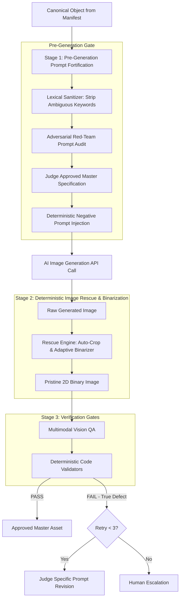

# CURIOKRAFT COLORING BOOK ENGINE
## Production Architecture, Packaging, Zero-Waste Generation & CLI User Guide

**Document Version:** 1.0  
**Status:** Approved Master Architecture & Technical Manual  
**Storage Location:** `dont-delete-alter/PROJECT_ARCHITECTURE_AND_USER_GUIDE.md`  
**Brand:** CurioKraft-Kids  
**Flagship Title:** TINY HANDS COLOR & LEARN (Vol 1)  

---

## 1. Executive Summary & Core Architectural Directives

This document defines the complete technical architecture, packaging specification, zero-waste generation strategy, and CLI operational manual for the CurioKraft Coloring Book Engine.

### Inviolable Technical Directives:
1. **Global Pip-Installable Package**: The entire codebase is structured as a modern, standalone Python package configured via `pyproject.toml`. It does not rely on a disconnected `requirements.txt` file and can be installed globally via `pip install .` or published directly to PyPI / private pip repositories.
2. **Near-Zero Image Generation Failure Strategy (Budget & Quota Protection)**: Because image generation API calls consume paid quotas, the system implements a strict **Pre-Generation Fortification & Image Rescue Pipeline** to minimize failures and drive the re-generation rate close to 0%.
3. **User-Controlled Sample Range (1–5 Pages)**: The sample validation phase allows the user to specify any sample count from **1 to 5 pages** (or specific page IDs) rather than enforcing a rigid 5-page batch.
4. **Dual-Layer Observability**: Clean, elegant `Rich` console UI with human-readable error summaries, paired with deep diagnostic logging (`logs/failures.log`, `logs/debug.log`) capturing full stack traces, bounding-box coordinates, and raw API payloads.
5. **Universal Reusability for Volume 2+**: Built with 100% configuration-driven architecture, enabling instant generation of Volume 2, Volume 3, or other coloring book series simply by passing a new YAML configuration and vocabulary manifest.

---

## 2. Python Package & Directory Structure

The project conforms to modern Python packaging standards (PEP 517 / PEP 621) using a standard `src/` layout:

```text
coloring-book/
│
├── dont-delete-alter/                       # 🔒 Read-only master reference documents
│   ├── TINY_HANDS_COLOR_AND_LEARN_Master_Project_Reference_v1.0.md
│   ├── agent_contract_system.md
│   ├── context.md
│   └── PROJECT_ARCHITECTURE_AND_USER_GUIDE.md  # (This document)
│
├── pyproject.toml                           # 📦 Modern Pip Packaging & Dependency Config
├── README.md                                # Package documentation
├── LICENSE                                  # Commercial license
│
├── config/                                  # ⚙️ Volume & Brand Configurations
│   ├── book_config.yaml                     # Master book specifications (8.5x11, 110p, no bleed)
│   ├── agents.yaml                          # 10 Agent system prompts, boundaries & models
│   ├── curriculum.yaml                      # Volume-agnostic spread layout & object purity rules
│   ├── taxonomy.yaml                        # Category keyword sets, visual templates & living taxonomy
│   └── kdp_spec.yaml                        # KDP margin, spine (0.248"), and cover geometry
│
├── manifest/                                # 📋 Curriculum & Semantic Databases
│   ├── objects.json                         # Semantic Object Registry & duplicate keys
│   ├── pages.json                           # Master 110-page manifest (with spread 'cards' arrays)
│   └── vocabulary.json                      # Alphabet & Number counting reservations
│
├── assets/                                  # 🎨 Static & Protected Brand Assets
│   ├── logo/curiokraft_logo.png             # Original CurioKraft vector/lossless logo
│   ├── emblem/curiokraft_emblem.png         # Original CurioKraft brand emblem
│   ├── fonts/BubblyRounded.ttf              # Licensed child-friendly vector font
│   └── templates/kdp_110p_cover.pdf         # Authoritative KDP guide layer template
│
├── src/
│   └── curiokraft_book/                     # 🐍 Main Python Package Root
│       ├── __init__.py                      # Package metadata (__version__ = "1.0.0")
│       ├── cli.py                           # Global CLI entrypoint (Typer/Rich)
│       │
│       ├── agents/                          # 🤖 Multi-Agent Logic & Contracts
│       │   ├── __init__.py
│       │   ├── base_agent.py                # Model-agnostic LLM interface with JSON schema validation
│       │   ├── director.py                  # Book Director orchestrator (AGT-001)
│       │   ├── specialists.py               # Design (AGT-002), KDP (AGT-003), Market (AGT-004), Edu (AGT-005)
│       │   ├── redteam_critic.py            # Adversarial flaw hunter (AGT-006)
│       │   ├── judge.py                     # Decision synthesizer & prompt spec builder (AGT-007)
│       │   ├── prompt_engineer.py           # Text-to-image prompt formatter (AGT-008)
│       │   ├── vision_qa.py                 # Multimodal visual inspector (AGT-009)
│       │   └── book_qa.py                   # Whole-book 110-page auditor (AGT-010)
│       │
│       ├── validators/                      # 🛡️ Deterministic Python Code Enforcement
│       │   ├── __init__.py
│       │   ├── dimensions.py                # Exact 2550x3300 px & 300 DPI verification
│       │   ├── margins.py                   # OpenCV/PIL bounding box & gutter safe-zone scanner
│       │   ├── grayscale.py                 # Non-binary pixel histogram & gray cluster detector
│       │   ├── duplicates.py                # Levenshtein distance & semantic duplicate guard
│       │   ├── pdf.py                       # PDF structure, page count & geometry validator
│       │   └── kdp_preflight.py             # 18-point machine-certified preflight engine
│       │
│       ├── rescue/                          # 🚑 Deterministic Image Rescue & Binarizer
│       │   ├── __init__.py
│       │   ├── binarizer.py                 # Adaptive thresholding to eliminate minor antialias gray
│       │   └── margin_fitter.py             # Auto-scale/pad image into exact 0.50" safe zone
│       │
│       ├── compositor/                      # 📐 Programmatic Vector & Document Assembly
│       │   ├── __init__.py
│       │   ├── typography.py                # Upper-case bubbly vector font renderer & spellchecker
│       │   ├── cover.py                     # 17.498x11.250" cover compositor with spine & barcode box
│       │   └── interior_pdf.py              # Lossless 110-page print PDF compiler
│       │
│       └── orchestrator/                    # 🚀 Execution & Pipeline State Engine
│           ├── __init__.py
│           ├── pipeline.py                  # Master batch execution engine
│           ├── debate_engine.py             # 4-round independent debate & judge manager
│           ├── state_manager.py             # SQLite/JSON state machine tracker
│           ├── retry_manager.py             # Prompt revision & escalation handler (Max 3)
│           └── model_client.py              # Unified API client (OpenAI, Anthropic, Gemini, Local)
│
├── generated/                               # 🖼️ Working Image Artifacts
│   ├── raw/                                 # Raw images directly from image API
│   ├── approved/                            # Fully validated master assets
│   └── rejected/                            # Rejected attempts tagged with diagnostic data
│
├── output/                                  # 📦 Final Publication Deliverables
│   ├── interior_masters/                    # 110 master PNGs (300 DPI with typography)
│   ├── interior/                            # Final Print-Ready Interior PDF
│   ├── cover/                               # Final Cover Master PNG + CMYK PDF
│   └── reports/                             # Preflight certificates & audit logs
│
└── logs/                                    # 📝 Observability, Diagnostics & Traces
    ├── pipeline.log                         # General lifecycle timeline
    ├── failures.log                         # Detailed failure reports with raw prompts
    └── debug.log                            # Full stack traces & raw API responses
```

---

## 3. Global Pip Installation & `pyproject.toml` Specification

The package is fully self-contained. All dependencies, CLI entrypoints, and metadata are declared inside `pyproject.toml`:

```toml
[build-system]
requires = ["setuptools>=61.0", "wheel"]
build-backend = "setuptools.build_meta"

[project]
name = "curiokraft-coloring-book"
version = "1.0.0"
description = "Multi-Agent AI & Deterministic Production Engine for Amazon KDP Coloring Books"
readme = "README.md"
requires-python = ">=3.10"
license = { text = "Proprietary" }
authors = [
    { name = "CurioKraft Publications", email = "publishing@curiokraft.com" }
]
keywords = ["kdp", "coloring-book", "publishing", "multi-agent", "image-generation"]

dependencies = [
    "typer[all]>=0.9.0",
    "rich>=13.7.0",
    "pydantic>=2.6.0",
    "pyyaml>=6.0.1",
    "Pillow>=10.2.0",
    "opencv-python-headless>=4.9.0",
    "numpy>=1.26.0",
    "reportlab>=4.1.0",
    "pymupdf>=1.23.0",
    "openai>=1.12.0",
    "anthropic>=0.18.0",
    "google-generativeai>=0.4.0",
    "requests>=2.31.0"
]

[project.scripts]
curiokraft-book = "curiokraft_book.cli:app"
ck-publish = "curiokraft_book.cli:app"

[tool.setuptools.packages.find]
where = ["src"]
```

### Installation Commands:
```powershell
# Local editable install (for development)
pip install -e .

# Global standard install (from repo root)
pip install .

# Now available globally anywhere in your terminal:
curiokraft-book --help
```

---

## 4. Near-Zero Image Generation Failure Strategy (Budget Protection)

To prevent wasting paid image generation quota, the system uses a **3-stage defensive architecture**:



### Stage 1: Pre-Generation Prompt Fortification
- **Lexical Sanitizer**: Strips any words from prompts that text-to-image models associate with realism, depth, or background (e.g. *photorealistic, detailed, realistic, textured, scene, environment, sitting on table*).
- **Deterministic Negative Prompt Hard-Locking**: Injects a proven negative prompt bundle:
  ```text
  color, colors, grayscale, gray shading, pencil shading, charcoal, gradient, shadows, 3D rendering, realistic, photo, textures, cross-hatching, stippling, tiny details, complex background, scenery, wallpaper, floor, frame, border, text, letters, watermark, signature, blurry, malformed anatomy.
  ```
- **Positive Prompt Anchor**: Automatically prefixes all object prompts with tested anchor syntax:
  ```text
  Ultra-clean children's coloring book page, single centered [OBJECT], bold thick clean black vector outlines, simple cute 2D flat style, large wide coloring spaces for toddlers ages 1-4, pure stark white background, minimalist line art, high contrast, no background.
  ```

### Stage 2: Deterministic Image Rescue Pipeline (`src/curiokraft_book/rescue/`)
Instead of rejecting an image that has minor antialiasing or slight margin encroachment (which would burn a quota call), our rescue engine automatically cleans the image:
1. **Adaptive Morphological Binarizer (`binarizer.py`)**: Uses Otsu thresholding to snap minor gray antialiased edge pixels ($>240 \rightarrow 255$, $<15 \rightarrow 0$) without altering line geometry.
2. **Auto-Margin Fitter (`margin_fitter.py`)**: If the line art slightly encroaches on the 0.50" margin, the engine automatically scales and centers the silhouette into the safe zone without distortion.

### Stage 3: Strict Defect Re-Generation Limits
If and only if an image contains a genuine structural hallucination (e.g. severed limb, malformed subject, wrong object), the Judge reviews the exact failure, revises the prompt parameters, and executes a controlled retry (hard limit of 3 attempts before escalating to the user).

---

## 5. CLI Operational Manual & User Guide

All commands run via the global executable `curiokraft-book` (or `python -m curiokraft_book.cli`).

### Command 1: Initialize & Audit Manifest
Performs semantic uniqueness checks and builds the frozen 110-page manifest.
```powershell
# Audit vocabulary for collisions (DRUM vs TOY DRUM, etc.)
curiokraft-book manifest audit

# Build and freeze master 110-page JSON manifest
curiokraft-book manifest build
```

---

### Command 2: Generate Configurable Sample Pages (Range: 1–5)
Allows you to specify how many sample pages you wish to test (from **1 to 5 pages**), or pass explicit page numbers:

```powershell
# Generate 1 single representative sample (Fast test)
curiokraft-book sample generate --count 1

# Generate 3 representative sample pages (e.g., Alphabet, Animal, Vehicle)
curiokraft-book sample generate --count 3

# Generate full 5 sample pages (Alphabet, Number, Fruit, Animal, Vehicle)
curiokraft-book sample generate --count 5

# Or generate specific page IDs of your choice:
curiokraft-book sample generate --pages "P001,P005,P047"
```

#### Review Sample Results:
```powershell
# Display visual QA scores, margin checks, and preview paths in a Rich Table
curiokraft-book sample review
```

---

### Command 3: Full 110-Page Interior Production Batch
Executes the batch production across all 9 category sections and 2 special sections.

```powershell
# Run the complete autonomous 110-page generation pipeline
curiokraft-book generate book

# Or run by specific category section:
curiokraft-book generate section --name "Fruits & Vegetables"
curiokraft-book generate section --name "Animals & Nature Creatures"

# Or generate a single specific page:
curiokraft-book generate page --id P005
```

---

### Command 4: Cover Master Generation & Compositing
Generates the colorful front/back hero art, overlays original logos, renders vector typography, and formats the $17.498 \times 11.250\text{ in}$ canvas.

```powershell
# Generate cover art and compose full KDP cover canvas
curiokraft-book cover build

# Validate cover dimensions, spine width (0.248 in), and barcode area (2.0x1.2 in)
curiokraft-book cover verify
```

---

### Command 5: PDF Compilation & Final KDP Preflight
Compiles the interior master PDF, cover CMYK PDF, and runs the 18-point preflight verification.

```powershell
# Compile the 110-page interior PDF with programmatic typography
curiokraft-book assemble interior

# Run the 18-point deterministic preflight diagnostic suite
curiokraft-book preflight run

# Export the certified machine preflight report
curiokraft-book preflight export-report
```

---

## 6. Observability, Rich Terminal UI & Logging Architecture

### A. Live Terminal UI (`Rich`)
The console provides high-visibility progress indicators and clean, concise error alerts:

```text
╭─────────────────────────────── Producing Page P005 (BANANA) ───────────────────────────────╮
│ Section: Fruits & Vegetables   │ Quota Protection: ACTIVE   │ Master: 2550x3300 px @ 300 DPI │
╰─────────────────────────────────────────────────────────────────────────────────────────────╯
⠋ [1/4] Pre-Generation Prompt Fortification... [DONE]
⠋ [2/4] Executing Image Generation API...      [DONE] (Latency: 2.1s)
⠋ [3/4] Running Rescue Binarizer & Margin Fit.. [DONE] (Rescue: Applied)
⠋ [4/4] Deterministic Validation Suite...      [PASSED]

✨ Page P005 Approved & Master Rendered!
   ├── Output Asset: output/interior_masters/page_005.png
   └── Quality Score: 9.8/10 (Zero Gray, Safe Bounds: Gutter 0.625", Outside 0.550")
```

If an unrecoverable failure occurs:
```text
❌ Page P045 Failed Deterministic Check (Attempt 1/3):
   • Issue: Missing enclosed line on right edge.
   • Action: Judge revised prompt geometry -> Triggering retry...
   [Trace Log: logs/failures.log | ID: TRC-P045-01]
```

---

### B. Deep Diagnostic Log Files (`logs/`)
1. **`logs/pipeline.log`**: Chronological event stream tracking state transitions.
2. **`logs/failures.log`**: Structured JSON post-mortem of every failure containing raw prompts, failure coordinates, and Judge revisions.
3. **`logs/debug.log`**: Complete Python stack traces, HTTP payload dumps, and image analysis metrics.

---

## 7. Multi-Volume Reusability (Volume 2, Volume 3 & New Series)

The engine is completely decoupled from any single book's content with **zero hardcoded state in Python code**:
- **`manifest/pages.json`**: Single source of truth for volume-specific page definitions and spread `cards` arrays (letter/number to object mappings, descriptions, and negative tokens).
- **`config/curriculum.yaml`**: Volume-agnostic spread layout templates, hollow bubble fill mandates, container uniformity rules, and object purity filters.
- **`config/taxonomy.yaml`**: Volume-agnostic semantic taxonomy database (living/inanimate keywords, category visual templates, inanimate exception keywords).

To produce **Volume 2**:

```powershell
# 1. Create a new volume manifest with new single-object pages & spread 'cards' arrays:
# manifest/pages_vol2.json (or config/vol2_config.yaml pointing to manifest)

# 2. Export and verify prompts for the new volume:
curiokraft-book prompt export --out generated/prompts_vol2.md

# 3. Produce the volume with zero code changes:
curiokraft-book generate book
curiokraft-book cover build
curiokraft-book assemble interior
curiokraft-book preflight run
```

The system automatically performs cross-volume duplicate audits (ensuring Vol 2 doesn't repeat Vol 1 objects), recalculates spine geometry, executes multi-agent debate, and generates the new print-ready PDFs.

---

## 8. Summary of Human Approval Checkpoints

| Gate | Checkpoint Name | Trigger Event | User Action Required |
|:---:|:---|:---|:---|
| **Gate 1** | **Blueprint & Manifest Sign-Off** | Manifest Frozen | Review vocabulary list and category allocations. *(Status: ✅ APPROVED)* |
| **Gate 2** | **Sample Pages Review (1–5 Pages)** | Samples Generated | Review user-selected 1–5 sample pages to confirm visual art style. |
| **Gate 3** | **Cover Master Review** | Cover Composed | Review front, spine ($0.248\text{ in}$), back, branding, and barcode area. |
| **Gate 4** | **Final Preflight & Book Sign-Off** | PDF Assembled | Review final 110-page interior PDF, Cover CMYK PDF, and preflight certificate. |
